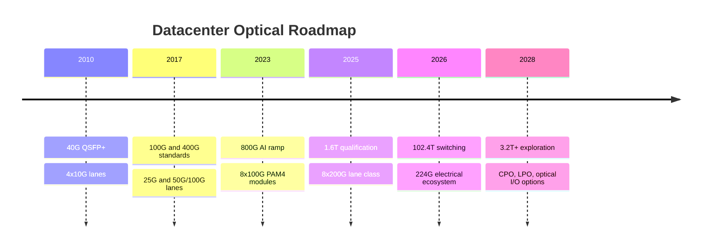
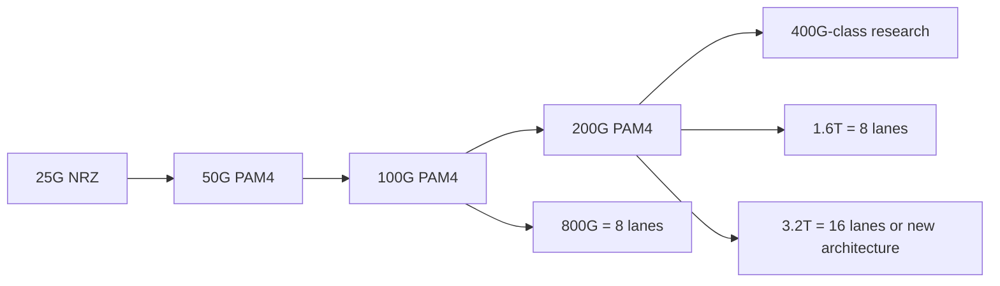

# Technology Roadmap
> **Last Updated:** 2026-06-30
> **Status:** Draft
> **Tags:** roadmap, Ethernet, lane-speed, switch-ASIC, 1.6T, 3.2T

## Overview
Datacenter bandwidth has scaled through faster lanes, more lanes per module, higher switch radix, improved modulation, and denser packaging. The industry moved from NRZ to PAM4 and from 25G to 50G and 100G lanes; the next major transition is 200G per lane, coordinated across SerDes, DSPs, optics, channels, connectors, and test equipment.

Dates describe first material ecosystem availability, not universal deployment. Product sampling, qualification, and high-volume manufacturing (HVM) can be separated by several years, especially for new optical architectures [See: [14_production_ramp_supply_chain.md](14_production_ramp_supply_chain.md)].

> 🔄 Refresh Needed: High Priority — validate 1.6T and 3.2T product status and IEEE/OIF milestones against 2026 records.

## Key Findings / Highlights
- [CONFIRMED] Ethernet aggregate rates progressed from 10G to 40G/100G, 400G, and 800G standards over roughly two decades [Source: IEEE 802.3, 2006-2024].
- [CONFIRMED] 51.2 Tb/s switch ASICs pair naturally with 64x800G or 128x400G ports [Source: Broadcom and switch-vendor specifications, 2023].
- [CONFIRMED] IEEE 802.3df standardized 800GbE; IEEE 802.3dj addresses 200G, 400G, 800G, and 1.6T objectives using 200G-class lanes [Source: IEEE, 2024].
- [ESTIMATED] 102.4T switches and 1.6T front-panel optics form the next broad system transition [MED confidence].
- [TO VERIFY] Claims of 3.2T volume in 2026-2027 should be treated as roadmap targets, not established production.

## Visual Guide

### Official Roadmap Visual References
| Organization | Visual Material to Review | Official Source |
|---|---|---|
| Ethernet Alliance | Ethernet speed roadmap and ecosystem timing graphics | https://ethernetalliance.org/technology/roadmap/ |
| IEEE 802.3 | project timelines, objectives, and standards status pages | https://www.ieee802.org/3/ |
| OIF | CEI-112G/224G and coherent implementation-agreement visuals | https://www.oiforum.com/technical-work/ |
| Broadcom | switch ASIC generation positioning and platform visuals | https://www.broadcom.com/products/ethernet-connectivity/switching/strataxgs |
| Marvell | optical DSP roadmap and module electrical-interface diagrams | https://www.marvell.com/products/networking/optical-dsp.html |
| NVIDIA | Spectrum-X / Quantum-X networking architecture visuals | https://www.nvidia.com/en-us/networking/ |

## Detailed Content
### Generation Timeline
| Year | Speed per Lane | Aggregate Switch Bandwidth | Form Factor | Key Technology | Leading Vendors | Volume Status |
|---|---:|---:|---|---|---|---|
| 2006 | 10G NRZ | sub-1T | XENPAK/XFP/SFP+ | serial 10G optics | Cisco, Finisar, Intel | [DEPRECATED] historical |
| 2010 | 10G | ~1T | QSFP+ | 4x10G for 40G | Broad ecosystem | [DEPRECATED] mature |
| 2013 | 25G | 3.2T class | CFP/QSFP28 | 4x25G 100G | Broadcom, Cisco, optical vendors | historical volume |
| 2020 | 50G/100G | 12.8T-25.6T | QSFP-DD/OSFP | PAM4, 400G DR4/FR4 | Broadcom, Arista, Innolight | mature volume |
| 2023 | 100G | 51.2T | OSFP/QSFP-DD | 800G 8x100G, 5 nm DSP/SerDes class | NVIDIA, Broadcom, Marvell, module vendors | AI-led ramp |
| 2025E | 200G | 102.4T class | OSFP/QSFP-DD variants | 1.6T 8x200G, advanced DSP | Broadcom, NVIDIA, Marvell, optics vendors | sampling/qualification [TO VERIFY] |
| 2026-2028E | 200G or future 400G | 102.4T-204.8T | OSFP-XD/future | 3.2T, LPO/CPO options | ecosystem TBD | pre-volume [LOW confidence] |
| 2028+ | WDM optical I/O | 204.8T+ | chiplet/CPO | optical chiplets, external laser | Broadcom, Ayar Labs, Intel and others | roadmap |

### Lane Progression
| Lane Rate | Signaling | Typical Aggregate Use | Principal Constraint |
|---:|---|---|---|
| 25G | NRZ | 100G = 4 lanes | channel loss and pin density |
| 50G | PAM4 | 200G/400G | SNR and FEC |
| 100G | PAM4 | 400G/800G | DSP power, optics bandwidth |
| 200G | PAM4 | 800G/1.6T | SerDes reach, linearity, thermal load |
| 400G [research] | TBD | potential 3.2T | device bandwidth and SNR |

### Enabling Technology by Generation
| Generation | Electrical | Optical Source/Modulator | Packaging | FEC/DSP |
|---|---|---|---|---|
| 100G | 25G NRZ | VCSEL, DML, EML | QSFP28 | modest DSP/CDR |
| 400G | 50G/100G PAM4 | EML, SiPh MZM/ring, VCSEL | QSFP-DD/OSFP | PAM4 equalization and stronger FEC |
| 800G | 100G PAM4 | 100G/lane EML/SiPh/VCSEL | OSFP/QSFP-DD | advanced-node DSP |
| 1.6T | 200G PAM4 | higher-bandwidth EML/SiPh | enhanced thermal/mechanical | 200G SerDes/DSP; possible LPO |
| 3.2T+ | 200G x16 or future lanes | WDM and/or CPO | XD/CPO/optical I/O | architecture dependent |

### Scaling Constraints
- **Bandwidth-distance product:** electrical insertion loss rises with frequency, shortening practical copper trace/cable reach.
- **Optical SNR:** higher-order or faster signaling reduces margin and raises FEC/equalization needs.
- **Fiber nonlinearity:** principally relevant to higher launch powers, dense WDM, and longer coherent links.
- **Faceplate density:** module width, cage count, connector count, airflow, and fiber routing constrain ports per RU.
- **Thermal density:** 800G modules commonly occupy a mid-to-high teens watt envelope; 1.6T designs can exceed 20 W depending reach and architecture [ESTIMATED].

### Standards Roadmap
| Body | Program | Role | Status at 2024/early 2025 baseline |
|---|---|---|---|
| IEEE | 802.3df | 800GbE | published/complete |
| IEEE | 802.3dj | 200G/lane and 1.6TbE objectives | active |
| OIF | CEI-112G | 112G electrical interfaces | implementation agreements available |
| OIF | CEI-224G | 224G electrical interfaces | active development |
| OIF | 400ZR | interoperable coherent DCI | deployed |
| OIF | 800ZR | next-generation coherent | active/developing [TO VERIFY] |

## Data Tables (where applicable)
| Field | Value | Source | Date |
|---|---|---|---|
| 400GbE standard | IEEE 802.3bs | IEEE | 2017 |
| 100G/lane electrical standard | IEEE 802.3ck | IEEE | 2022 |
| 800GbE standard | IEEE 802.3df | IEEE | 2024 |
| 200G/lane project | IEEE 802.3dj | IEEE | 2024 active |
| 51.2T port mapping | 64x800G | Switch vendor specifications | 2023 |

## Open Questions / Gaps
- Confirm exact ratification date and final scope for 802.3dj.
- Track whether 1.6T volume favors 8x200G or alternative optical lane arrangements.
- Separate first samples, customer qualification, and HVM for each vendor.
- Quantify physical channel loss budgets for CEI-224G LR/MR/XSR classes.
- Identify credible 3.2T module standards and production dates.

## References
- IEEE 802.3 Ethernet Working Group | https://www.ieee802.org/3/ | 2026-06-09
- IEEE 802.3dj | https://www.ieee802.org/3/dj/ | 2026-06-09
- OIF CEI work | https://www.oiforum.com/technical-work/hot-topics/common-electrical-i-o-cei/ | 2026-06-09
- Ethernet Alliance roadmap | https://ethernetalliance.org/technology/roadmap | 2026-06-09
- Broadcom Tomahawk family | https://www.broadcom.com/products/ethernet-connectivity/switching/strataxgs/bcm78900-series | 2026-06-09
