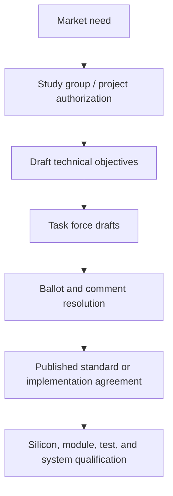
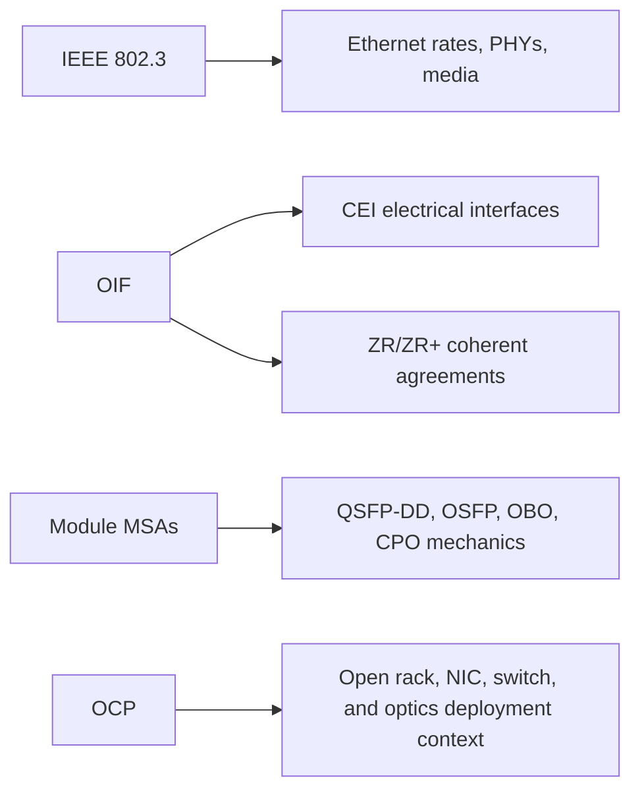

# Standards and Multi-Source Agreements
> **Last Updated:** 2026-06-30
> **Status:** In Review
> **Tags:** IEEE-802.3, OIF, MSA, CMIS, Ethernet

## Overview
IEEE defines Ethernet PHYs and media specifications; OIF develops implementation agreements for interoperable electrical, coherent, management, co-packaging, and external-laser interfaces; MSAs define practical form factors and optical specifications outside or ahead of formal standards. Product labels may combine an IEEE rate with an MSA reach, mechanical form factor, and OIF management interface.

The current distinction is important: IEEE P802.3dj reached Draft 3.0 Standards Association ballot in 2026 but is not yet a final standard. OIF has already published 800ZR, 800LR, ELSFP 2.0, CEI 5.3, RTLR, and CMIS 5.4 while separate 1600ZR, 1600ZR+, 1600CL, NPO, compute-optics, and 448G projects remain active.

> ⚠️ Note: An active task force or project is not an approved specification, and a published specification does not by itself guarantee multi-vendor interoperability.

## Key Findings / Highlights
- [CONFIRMED] IEEE 802.3bs, 802.3cd, 802.3ck, and 802.3df are published standards covering 400GbE, intermediate rates, 100G electrical lanes, and 800GbE respectively [Source: IEEE 802.3, 2017-2024].
- [CONFIRMED] IEEE P802.3dj Draft 3.0 was in Standards Association ballot by March-June 2026; the adopted timeline targets completion in 2026, subject to ballot resolution and approval [Source: IEEE P802.3dj, 2026-06-04].
- [CONFIRMED] OIF-800ZR-01.0 was published in October 2024 and OIF-800LR-01.0 in April 2025 [Source: OIF IA register].
- [CONFIRMED] CMIS 5.4 was published in May 2026 [Source: OIF IA register, 2026-05].
- [CONFIRMED] OIF active work includes 1600ZR, 1600ZR+, 1600CL, 12.8T NPO, Compute Optics Interface, and 448G signaling [Source: OIF Current Work, accessed 2026-06-09].

## Visual Guide

## Detailed Content
### IEEE 802.3 Status
| Project | Scope | Current Stage | Latest Public Evidence | Completion |
|---|---|---|---|---|
| IEEE 802.3bs | 200/400GbE | [CONFIRMED] published | IEEE standard | 2017 |
| IEEE 802.3cd | 50/100/200GbE | [CONFIRMED] published | IEEE standard | 2018 |
| IEEE 802.3ck | 100G electrical lanes | [CONFIRMED] published | IEEE standard | 2022 |
| IEEE 802.3df | 800GbE | [CONFIRMED] published | IEEE standard | 2024 |
| IEEE P802.3dj | 200G, 400G, 800G, 1.6T Ethernet | [CONFIRMED] Draft 3.0 SA ballot | unsatisfied-comments list dated 2026-06-04 | 2026 target; not final |

### P802.3dj Ballot Record
| Milestone | Date | Interpretation |
|---|---|---|
| Draft 2.0 Working Group ballot comments | 2025-06-16 | Working Group ballot phase underway |
| Draft 2.4 | 2026-02-13 | zero comments received |
| Draft 3.0 SA ballot comments received | 2026-03-30 | Standards Association ballot underway |
| Draft 3.0 final responses | 2026-05-18 | comment resolution progressed |
| Draft 3.0 unsatisfied-comments list | 2026-06-04 | project remains unfinished |

### Published OIF Agreements
| Document | Scope | Publication | Status |
|---|---|---:|---|
| OIF-400ZR-03.0 | updated interoperable 400G coherent DCI | 2024-10 | [CONFIRMED] published |
| OIF-800ZR-01.0 | interoperable 800G coherent DCI | 2024-10 | [CONFIRMED] published |
| OIF-ELSFP-02.0 | external laser small form factor pluggable | 2025-01 | [CONFIRMED] published |
| OIF-800LR-01.0 | 800G coherent light/reach interface | 2025-04 | [CONFIRMED] published |
| OIF-C-CMIS-01.4 | coherent CMIS | 2025-04 | [CONFIRMED] published |
| OIF-CEI-05.3 | CEI through current 112G+ classes | 2025-07 | [CONFIRMED] published; not a CEI-224G IA |
| OIF-CMIS-VCS-01.1 | versatile control set | 2025-07 | [CONFIRMED] published |
| OIF-EEI-112G-RTLR-01.0 | retimed transmitter / linear receiver | 2025-10 | [CONFIRMED] published |
| OIF-CMIS-05.4 | common module management | 2026-05 | [CONFIRMED] published |

### Active OIF Work
| Project | Target | Current Meaning |
|---|---|---|
| 448G signaling work | future AI electrical I/O | requirements/research stage; no published CEI-448G IA found |
| 12.8T NPO module | 12.8T and 6.4T at 200G/lane | mechanical, electrical, cooling, laser, power, and connector IA development |
| Compute Optics Interface | optical PCIe/NVLink/UALink-class scale-up | low-latency photonic-interface project |
| 1600CL | campus links optimized for power and latency | active coherent-light project building on 800LR |
| 1600ZR | 1.6T DP-16QAM, up to 120 km amplified DCI target | active IA development |
| 1600ZR+ | 1.6T up to 1,000 km; 1.2T up to 2,000 km target | active IA development |
| 1.6T pluggable MACsec | coherent-pluggable security profile | technical white-paper project |

### MSA and Interface Ecosystem
| Group / Specification | Scope | Current Treatment |
|---|---|---|
| QSFP-DD MSA | 8-lane double-density QSFP mechanical/electrical interface | widely deployed; track revision compatibility |
| OSFP MSA | 8-lane pluggable with larger thermal envelope | widely deployed at 800G; 1.6T ecosystem developing |
| OSFP-XD | 16-lane extra-density proposal | emerging; adoption remains [TO VERIFY] |
| 100G Lambda MSA | 100G/lambda optical PMDs | deployed ecosystem |
| OpenZR+ MSA | coherent modes beyond baseline ZR | deployed/expanding |
| CMIS | module controls, telemetry, applications | version 5.4 published 2026-05 |
| MDIO | Ethernet PHY management bus | mature |
| COBO | on-board optics concepts | limited deployment; influenced NPO/CPO work |

### Specification Layers
| Layer | Example | Defines |
|---|---|---|
| Mechanical | OSFP, QSFP-DD | dimensions, cage, connector, thermal/mechanical limits |
| Electrical | IEEE 802.3ck, OIF CEI/EEI | host/module signaling and loss budgets |
| Optical PMD | 400GBASE-DR4, 800GBASE-DR8 | wavelength, lanes, reach, optical metrics |
| Management | CMIS | module controls, telemetry, applications |
| Coherent interoperability | 400ZR, 800ZR, OpenZR+ | framing, modulation, FEC, operating modes |

### Corrected 2026 Terminology
| Prior Phrase | Correct Treatment |
|---|---|
| “CEI-224G active” | track named 224G/448G work separately; CEI 5.3 is the published agreement family currently listed |
| “800ZR developing” | [DEPRECATED]; OIF-800ZR-01.0 published 2024-10 |
| “CMIS 5.3 latest” | [DEPRECATED]; CMIS 5.4 published 2026-05 |
| “802.3dj active” | insufficiently precise; Draft 3.0 SA ballot, not ratified |
| “IEEE CPO study group” | no separate current IEEE CPO standard identified; do not conflate Ethernet PHY and OIF co-packaging work |

## Data Tables (where applicable)
| Field | Value | Source | Date |
|---|---|---|---|
| P802.3dj current draft | D3.0 | IEEE comments register | 2026-06-04 |
| 800ZR publication | OIF-800ZR-01.0 | OIF | 2024-10 |
| 800LR publication | OIF-800LR-01.0 | OIF | 2025-04 |
| CMIS latest public revision | 5.4 | OIF | 2026-05 |
| NPO target | 12.8T / 6.4T at 200G/lane | OIF | active 2026 |

## Open Questions / Gaps
- Record final P802.3dj approval date and amendment number when published.
- Track future OIF agreements explicitly covering 224G and 448G classes.
- Add clause-level P802.3dj PMD and reach mapping after final approval.
- Track 1600ZR/1600ZR+ ballots, plugfests, and interoperability results.
- Maintain OSFP, QSFP-DD, OpenZR+, and CMIS compatibility by revision.

## References
- IEEE P802.3dj Task Force | https://www.ieee802.org/3/dj/ | 2026-06-09
- IEEE P802.3dj Comments | https://www.ieee802.org/3/dj/comments/index.html | 2026-06-09
- IEEE P802.3dj Adopted Timeline | https://www.ieee802.org/3/dj/projdoc/timeline_3dj_241114.pdf | 2026-06-09
- OIF Implementation Agreements | https://www.oiforum.com/technical-work/implementation-agreements-ias/ | 2026-06-09
- OIF Current Work | https://www.oiforum.com/technical-work/current-work/ | 2026-06-09
- QSFP-DD MSA | http://www.qsfp-dd.com/ | 2026-06-09
- OSFP MSA | https://osfpmsa.org/ | 2026-06-09
- OpenZR+ MSA | https://openzrplus.org/ | 2026-06-09
