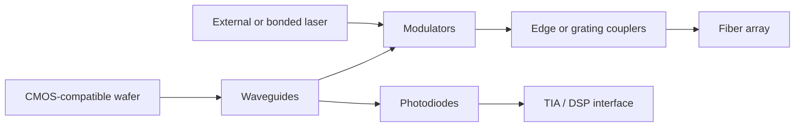
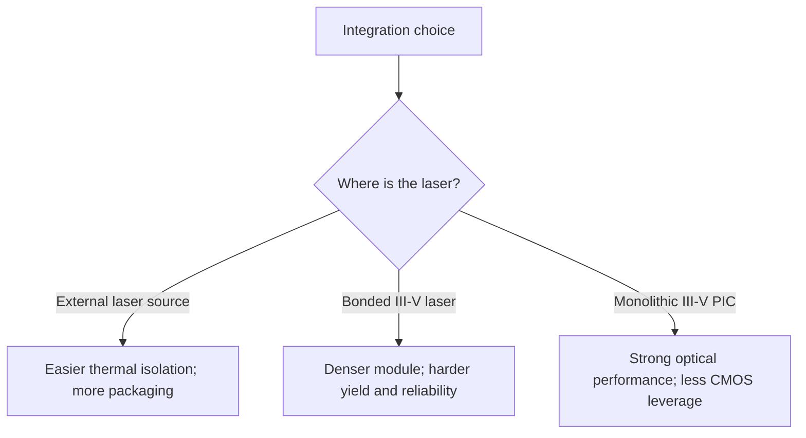

# Silicon Photonics
> **Last Updated:** 2026-06-30
> **Status:** Draft
> **Tags:** silicon-photonics, foundry, integration, lasers, LPO

## Overview
Silicon photonics (SiPh) uses semiconductor-compatible processes to integrate waveguides, modulators, splitters, filters, and germanium photodetectors on a photonic integrated circuit (PIC). It benefits from wafer-scale processing and electronic packaging infrastructure but still relies heavily on III-V materials for efficient lasers.

SiPh competes with and complements InP/EML and VCSEL platforms. Its strongest system value appears where integration, WDM, channel count, or co-packaging offsets coupling loss, thermal control, and packaging complexity [See: [06_co_packaged_optics.md](06_co_packaged_optics.md)].

> 🔄 Refresh Needed: High Priority — verify current commercial foundry process availability, design kits, customer programs, and capacity.

## Key Findings / Highlights
- [CONFIRMED] SOI offers high index contrast and compact waveguides but increases sensitivity to dimensional and temperature variation [Source: silicon photonics literature, 2010-2024].
- [CONFIRMED] Germanium-on-silicon photodetectors provide telecom-wavelength detection compatible with SiPh flows.
- [CONFIRMED] Rings are compact and low-energy but thermally sensitive; MZMs are larger but generally more broadband and tolerant.
- [CONFIRMED] External laser sources remain common because silicon is an inefficient light emitter.
- [ESTIMATED] Packaging, coupling, test, and laser attach can dominate cost and yield more than the bare PIC [Source: AIM Photonics/OFC presentations, 2023; HIGH confidence].

## Visual Guide

## Detailed Content
### Device Fundamentals
| Device | Role | Strength | Weakness |
|---|---|---|---|
| SOI waveguide | light routing | compact, CMOS-compatible | sidewall loss, polarization, thermal drift |
| Ring modulator | intensity modulation/filter | small, potentially low capacitance | narrowband; heater/control overhead |
| MZM | phase-to-intensity modulation | broadband, linear | area and drive voltage |
| Ge photodetector | receive conversion | integrated, high bandwidth | process complexity and dark current |
| Grating coupler | vertical fiber coupling | wafer-level test potential | wavelength/polarization and loss |
| Edge coupler | facet fiber coupling | lower loss/broadband potential | precise assembly and facet prep |

### Foundry Landscape
| Player | Platform / Role | Status | Notes |
|---|---|---|---|
| Intel | internal high-volume SiPh and product manufacturing | [CONFIRMED] commercial | long datacenter-transceiver history |
| GlobalFoundries | GF Fotonix | [CONFIRMED] commercial | monolithic RF CMOS + photonics positioning |
| TSMC | COUPE / silicon photonics ecosystem | announced/developing at baseline | advanced packaging linkage [TO VERIFY] |
| Tower Semiconductor | silicon photonics foundry platform | [CONFIRMED] commercial | open-foundry model |
| imec | R&D/pilot platforms | [CONFIRMED] | advanced devices and ecosystem transfer |
| CEA-Leti | R&D/pilot integration | [CONFIRMED] | heterogeneous integration research |
| AIM Photonics | US MPW/PDK/test ecosystem | [CONFIRMED] | shared infrastructure and workforce |

### Integration Approaches
| Approach | Description | Advantage | Risk |
|---|---|---|---|
| Monolithic | electronics and photonics in one process | shortest interconnect | process compromise, cost |
| Flip-chip | separate EIC and PIC joined by bumps | optimize each die | bump parasitics and assembly yield |
| Wafer bonding | bond III-V or other material at wafer/die scale | dense laser integration | defect/yield/process control |
| 2.5D/3D | interposer, bridge, hybrid bonding | bandwidth density | thermal and supply-chain complexity |
| Micro-transfer printing | place small known-good III-V devices | material efficiency and heterogeneous mix | placement throughput/reliability |

### LPO vs DSP Pluggables
| Dimension | DSP Pluggable | LPO |
|---|---|---|
| Equalization | module DSP + host SerDes | host SerDes/analog path |
| Power | higher | potentially lower |
| Reach/margin | stronger compensation | channel-sensitive |
| Interoperability | mature digital boundary | tighter host-module co-design |
| Latency | higher DSP/FEC contribution | potentially lower |
| Deployment risk | lower | higher qualification complexity |

### Laser Integration
| Method | Example | Benefit | Challenge |
|---|---|---|---|
| External CW laser | fiber-coupled source feeding PIC | separates hot/reliability-critical laser | coupling and distribution loss |
| Edge-coupled III-V | DFB/laser die adjacent to PIC | mature known-good die | alignment and attach |
| Bonded III-V | III-V material bonded on silicon | compact integration | yield and thermal mismatch |
| Micro-transfer printing | small laser coupons placed on PIC | scalable heterogeneous integration potential | industrial maturity [TO VERIFY] |

### IP Leaders
Intel, Cisco/Acacia, Broadcom, IBM, GlobalFoundries, imec, CEA-Leti, Coherent, Lumentum, and university spinouts hold substantial device, packaging, control, and manufacturing IP. Patent counts require database-specific normalization [See: [12_patents_ip_landscape.md](12_patents_ip_landscape.md)].

## Data Tables (where applicable)
| Field | Value | Source | Date |
|---|---|---|---|
| Common substrate | Silicon-on-insulator | SiPh literature | 2024 |
| Integrated detector material | Germanium | SiPh literature | 2024 |
| Silicon laser limitation | indirect bandgap | semiconductor physics | established |
| Commercial open platform | GF Fotonix | GlobalFoundries | 2022 launch |
| US ecosystem | AIM Photonics | US DoD/AIM | active 2024 |

## Open Questions / Gaps
- Compare measured wafer yield and packaging yield by foundry/process.
- Quantify coupling loss distributions, not best-case demonstrations.
- Track production readiness of bonded and transfer-printed lasers.
- Separate heater power from modulator switching energy in ring claims.
- Map PDK availability, MPW cadence, design rules, and qualified OSATs.

## References
- GlobalFoundries GF Fotonix | https://gf.com/technology-platforms/fotonix/ | 2026-06-09
- Intel Silicon Photonics | https://www.intel.com/content/www/us/en/architecture-and-technology/silicon-photonics/silicon-photonics-overview.html | 2026-06-09
- AIM Photonics | https://www.aimphotonics.com/ | 2026-06-09
- imec Silicon Photonics | https://www.imec-int.com/en/what-we-offer/research-portfolio/silicon-photonics | 2026-06-09
- Tower Semiconductor SiPho | https://towersemi.com/technology/silicon-photonics/ | 2026-06-09
