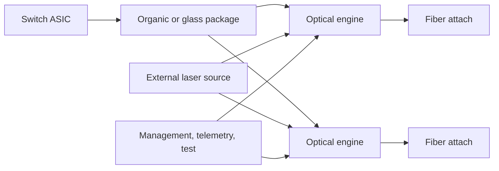
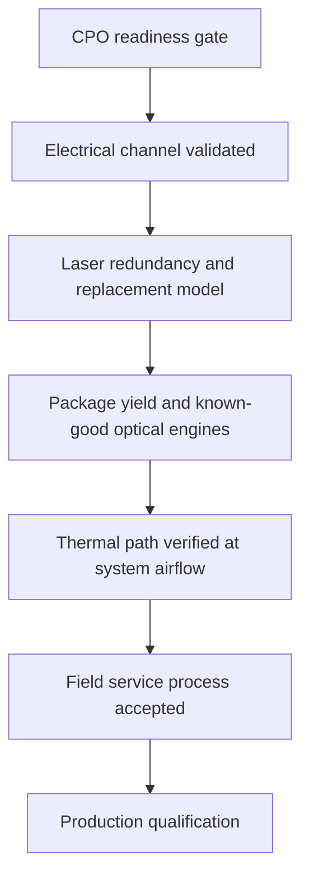

# Co-Packaged Optics
> **Last Updated:** 2026-06-30
> **Status:** In Review
> **Tags:** CPO, optical-I-O, switch-ASIC, packaging, external-laser

## Overview
Co-packaged optics places optical engines adjacent to a switch or compute ASIC on a shared package substrate or tightly integrated assembly. It replaces long, power-hungry high-speed electrical paths to front-panel modules with short electrical connections and fiber leaving the package.

CPO has progressed from framework work and demonstrations to named platforms, disclosed early adopters, purchase commitments, and capacity investments. Broadcom has disclosed customer deliveries for its 51.2T Bailly system, while NVIDIA's Quantum-X and Spectrum-X Photonics systems are 2026 rollout programs. This does not yet establish broad high-volume replacement of 800G and 1.6T pluggables.

> ⚠️ Note: Product performance and power figures below are supplier claims unless explicitly identified as independently measured. “Announced,” “sampled,” “delivered,” and “high-volume production” are different milestones.

## Key Findings / Highlights
- [CONFIRMED] Broadcom's Bailly combines a Tomahawk 5 switch ASIC with eight 6.4 Tb/s silicon-photonics engines for 51.2 Tb/s; Broadcom stated in March 2024 that systems had been delivered to several customers [Source: Broadcom announcement coverage, 2024-03-14].
- [CONFIRMED] NVIDIA announced Quantum-X and Spectrum-X Photonics in March 2025, with 2026 rollout timing [Source: NVIDIA GTC/Hot Chips disclosures, 2025].
- [CONFIRMED] NVIDIA disclosed 144x800G / 115.2T for Quantum-X, 128x800G / 102.4T for SN6810, and a 512x800G / 409.6T system for SN6800 [Source: NVIDIA, 2025-2026].
- [CONFIRMED] External laser source modules improve laser serviceability and isolate laser heat and reliability from the switch package [Source: OIF ELSFP work].
- [ESTIMATED] 2026 is an early-system-adoption year for CPO, with package yield, repair model, field reliability, and independent power data still gating broad adoption [MED confidence].

## Visual Guide

## Detailed Content
### Architecture
| Element | Role | Design Issue |
|---|---|---|
| Switch/compute ASIC | packet forwarding or accelerator I/O | heat flux and package-edge bandwidth |
| Optical engine | electrical/optical conversion | yield, wavelength control, replaceability |
| External laser source | continuous-wave optical power | redundancy, safety, distribution loss |
| Fiber attach unit | package-to-fiber connection | alignment, contamination, rework |
| Substrate/interposer | electrical and mechanical integration | warpage, signal integrity, cost |
| Control/telemetry | bias, temperature, alarms | calibration and failure isolation |

### CPO vs Pluggable
| Dimension | Pluggable | CPO |
|---|---|---|
| Electrical path | ASIC-board-cage-module | short package path |
| I/O energy | higher at fastest lanes | potentially lower |
| Serviceability | replace individual module | package/system repair complexity |
| Yield isolation | known-good module | multiplicative assembly-yield risk |
| Thermal environment | faceplate | adjacent to hot ASIC |
| Vendor interchangeability | relatively high | tighter co-design |
| Time to market | mature ecosystem | longer qualification |
| Latency | DSP-dependent | architecture-dependent; potentially lower |

### Product Status Matrix
| Vendor | Product / Program | Capacity | Architecture | Public Status | Timing | Evidence Quality |
|---|---|---:|---|---|---|---|
| Broadcom | Bailly + Tomahawk 5 | 51.2 Tb/s | 8 x 6.4T CPO engines | [CONFIRMED] delivered to several customers | disclosed 2024 | company statement; quantities/customer identities limited |
| Broadcom | Tomahawk 6 generation | 102.4 Tb/s class | pluggable/CPO ecosystem options | [CONFIRMED] generation announced; exact CPO SKU varies | 2025-2026 | SKU validation required |
| NVIDIA | Quantum-X Photonics | 115.2 Tb/s; 144x800G | liquid-cooled InfiniBand CPO switch | [CONFIRMED] announced; adopters named | 2026 rollout | deployment validation pending |
| NVIDIA | Spectrum SN6810 | 102.4 Tb/s; 128x800G | liquid-cooled Ethernet CPO switch | [CONFIRMED] announced | 2H 2026 target | official roadmap |
| NVIDIA | Spectrum SN6800 | 409.6 Tb/s; 512x800G | system-scale photonics platform | [CONFIRMED] announced | 2H 2026 target | confirm system versus single-ASIC boundary |
| Marvell | custom XPU CPO platform | multi-terabit | CPO in custom accelerator designs | [CONFIRMED] design engagement offered | announced 2025 | no named HVM deployment |
| Ayar Labs | TeraPHY + SuperNova | multi-Tb/s optical I/O | in-package WDM chiplet + external laser | [CONFIRMED] demonstrations/partner programs | qualification | no public HVM volume |
| Ranovus | Odin / ORON | multi-Tb/s engines | CPO/NPO optical engines | [CONFIRMED] demonstrations/partner programs | pre-HVM | deployment quantities undisclosed |
| Lightmatter | Passage | optical interconnect fabric | photonic scale-up fabric | [CONFIRMED] development/sampling | pre-HVM | customer volume undisclosed |
| Celestial AI | Photonic Fabric | optical scale-up/memory fabric | photonic connectivity platform | transaction status [TO VERIFY] | development | see [20_investment_and_ma_tracker.md](20_investment_and_ma_tracker.md) |

### Adoption Evidence
| Organization | Platform / Supplier | Disclosure | Interpretation |
|---|---|---|---|
| TACC | NVIDIA Quantum-X Photonics | named prospective adopter | credible early deployment signal |
| Oak Ridge National Laboratory | NVIDIA Quantum-X Photonics | named prospective adopter | HPC validation pathway |
| CoreWeave | NVIDIA Quantum-X Photonics | named prospective adopter | cloud AI signal |
| Lambda | NVIDIA Quantum-X Photonics | named prospective adopter | cloud AI signal |
| ByteDance | Broadcom CPO | executive testimonial | ecosystem support, not proof of volume award |
| undisclosed customers | Broadcom Bailly | several customer deliveries disclosed | shipment evidence without quantity |

### Vendor Claim Boundary
| Metric | Pluggable Baseline Claimed | CPO Claimed | Status |
|---|---:|---:|---|
| NVIDIA per-port power | ~30 W/800G | ~9 W/800G | [CONFIRMED vendor model], not independent full-system measurement |
| NVIDIA electrical loss | ~22 dB | ~4 dB | [CONFIRMED vendor design comparison] |
| NVIDIA efficiency | 1.0x | 3.5x | [CONFIRMED vendor claim] |
| Broadcom optical-interconnect power | baseline | 70% lower | [CONFIRMED vendor claim] |

Detailed power-boundary treatment is maintained in [17_power_and_thermal.md](17_power_and_thermal.md).

### Readiness Gate
| Gate | Bailly 51.2T | NVIDIA 102.4T+ | Optical-I/O Chiplets |
|---|---|---|---|
| Named silicon | yes | yes | yes |
| Named system SKU | yes | yes | generally no complete switch SKU |
| Customer shipment | limited disclosure | prospective/early | partner samples |
| Independent watts/Tb test | no public dataset found | no public dataset found | no public dataset found |
| Field failure data | undisclosed | undisclosed | undisclosed |
| HVM volume | undisclosed | not established publicly | not established publicly |

### Switch Roadmap
| Switch Capacity | Front-Panel Equivalent | CPO Relevance | Window |
|---:|---|---|---|
| 51.2T | 64x800G | pluggables practical; Bailly CPO available | 2023-2026 |
| 102.4T | 64x1.6T or 128x800G | stronger electrical and thermal case | 2025-2027E |
| 204.8T | 128x1.6T or 64x3.2T | CPO/NPO/optical I/O increasingly likely | 2027+ [LOW confidence] |

### Production Readiness Checklist
- Screen known-good die and engines before final assembly.
- Define passive/active alignment and rework strategy.
- Provide external-laser redundancy and safe hot-swap behavior.
- Isolate switch heat from rings, lasers, modulators, and TIAs.
- Qualify fiber attach under shock, vibration, contamination, and service.
- Test every channel and wavelength at package level.
- Contain field failures without replacing the entire switch where possible.

### Standards Boundary
OIF has published a CPO framework and ELSFP agreements and is developing NPO and compute-optics interfaces. IEEE Ethernet projects define PHY objectives and interfaces but should not be described as a separate current “IEEE CPO standard.” See [03_standards_and_msa.md](03_standards_and_msa.md).

## Data Tables (where applicable)
| Field | Value | Source | Date |
|---|---|---|---|
| Bailly engines | 8 x 6.4 Tb/s | Broadcom | 2024-03 |
| Quantum-X ports | 144 x 800G | NVIDIA | 2025-2026 roadmap |
| SN6810 ports | 128 x 800G | NVIDIA | 2025-2026 roadmap |
| SN6800 system ports | 512 x 800G | NVIDIA | 2025-2026 roadmap |
| OIF NPO target | 12.8T and 6.4T modules | OIF | active 2026 |

## Open Questions / Gaps
- Obtain generally available dates, shipment units, pricing, package yield, and field reliability for each CPO SKU.
- Clarify the SN6800 409.6T system boundary.
- Verify Tomahawk 6 CPO configurations and named customers.
- Publish independent switch-level watts/Tb, BER margin, and cooling measurements.
- Quantify repair economics and failed-engine isolation.

## References
- OIF Co-Packaging | https://www.oiforum.com/technical-work/hot-topics/co-packaging/ | 2026-06-09
- OIF Current Work | https://www.oiforum.com/technical-work/current-work/ | 2026-06-09
- Broadcom CPO | https://www.broadcom.com/solutions/data-center/co-packaged-optics | 2026-06-09
- Broadcom Bailly coverage | https://www.investors.com/news/technology/broadcom-stock-avgo-bailly-cpo-ethernet-switch-ai/ | 2026-06-09
- NVIDIA Networking | https://www.nvidia.com/en-us/networking/ | 2026-06-09
- NVIDIA Hot Chips roadmap coverage | https://www.tomshardware.com/networking/nvidia-outlines-plans-for-using-light-for-communication-between-ai-gpus-by-2026-silicon-photonics-and-co-packaged-optics-may-become-mandatory-for-next-gen-ai-data-centers | 2026-06-09
- Ayar Labs | https://ayarlabs.com/ | 2026-06-09
- Ranovus | https://ranovus.com/ | 2026-06-09
