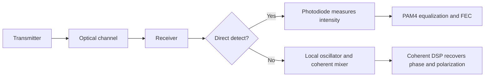
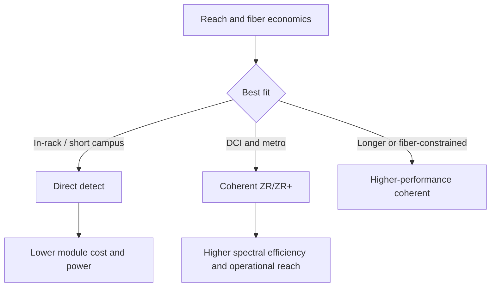

# Coherent vs Direct Detect
> **Last Updated:** 2026-06-30
> **Status:** Draft
> **Tags:** coherent, IMDD, PAM4, ZR, DCI

## Overview
Direct-detect links encode information primarily in optical intensity and recover it with a photodiode. Coherent links mix the received signal with a local oscillator and use DSP to recover amplitude, phase, frequency, and polarization, providing much higher spectral efficiency and impairment tolerance at greater cost and power.

Datacenter choice is reach- and fiber-constrained. IM-DD PAM4 remains preferred for short intra-datacenter links; coherent dominates long DCI and is moving toward shorter reaches as DSP power and cost fall and fiber/WDM value rises.

> 🔄 Refresh Needed: High Priority — update 800ZR, coherent-lite, and 2025-2026 ZR+ interoperability status.

## Key Findings / Highlights
- [CONFIRMED] 400ZR standardized interoperable 400G coherent DCI in a pluggable module class [Source: OIF, 2020].
- [CONFIRMED] Coherent detection compensates chromatic dispersion and polarization effects electronically.
- [CONFIRMED] IM-DD avoids local-oscillator and coherent DSP complexity and is favored below roughly 10 km today.
- [ESTIMATED] The coherent/direct-detect crossover depends more on fiber count, reach, operations, and total link cost than distance alone [HIGH confidence].
- [TO VERIFY] 800ZR and coherent solutions below traditional DCI reaches may shift the crossover during 2025-2028.

## Visual Guide

## Detailed Content
### Technical Comparison
| Dimension | Direct Detect (IM-DD) | Coherent |
|---|---|---|
| Measured quantity | intensity | amplitude and phase via I/Q; dual polarization possible |
| Typical modulation | NRZ, PAM4 | QPSK, 16QAM and variants |
| Laser requirements | lower complexity | narrow-linewidth Tx and local oscillator |
| DSP | equalization/FEC | heavy carrier, polarization, dispersion processing |
| Spectral efficiency | lower | higher |
| Dispersion tolerance | limited | high with DSP |
| Cost/power | lower | higher |
| Best fit | intra-DC and campus | DCI, metro, long-haul |

### Reach Matrix
| Reach | Technology | Typical Use Case | Module Power | Relative Cost |
|---|---|---|---:|---|
| <100 m | DAC/AEC, VCSEL MMF, SMF SR/DR variants | server-rack-row | low to medium | low-medium |
| 100 m-2 km | PAM4 DR/FR | leaf-spine / campus | medium | medium |
| 2-10 km | PAM4 LR/FR variants, WDM | campus/DCI | medium-high | medium-high |
| 10-80 km | coherent-lite, 400ZR edge; some IM-DD | metro DCI | high | high |
| 80-400 km | 400ZR/OpenZR+ | regional DCI | high | high |
| >400 km | performance coherent | metro/long-haul | high to very high | high |

### Coherent Ecosystem
| Player | Role | Products / Capability |
|---|---|---|
| Cisco / Acacia | coherent DSP, modules, systems | 400ZR/ZR+ and higher-performance coherent |
| Ciena | DSP and transport systems | WaveLogic family |
| Nokia / Infinera | DSP, PICs, transport | PSE and ICE technology portfolios |
| Marvell | merchant coherent DSP | COLORZ/Orion-era Inphi portfolio and successors |
| Coherent Corp | components/modules | lasers, modulators, modules |
| Lumentum / former NeoPhotonics assets | coherent components | narrow-linewidth lasers, modulators, receivers |

> ⚠️ Note: Nokia announced its Infinera acquisition in 2024; closing/integration status and product naming must be updated from current filings.

### 400ZR, OpenZR+, and 800ZR
| Specification | Primary Goal | Reach / Performance | Interoperability |
|---|---|---|---|
| 400ZR | router-to-router DCI | standardized 400G metro DCI class | strong multi-vendor target |
| OpenZR+ | broader modes and reach | higher coding gain / flexible operational modes | MSA profiles; verify mode-by-mode |
| 800ZR | 800G coherent DCI | next-generation DCI | active/developing at baseline [TO VERIFY] |
| Proprietary ZR+ | optimized vendor performance | may exceed MSA reach | interoperability may be limited |

### Crossover Economics
A coherent link becomes attractive when avoided fiber pairs, amplification simplification, longer unrepeated reach, and operational consistency outweigh coherent DSP and laser cost. A robust model should include module power, host cooling, fiber lease/installation, mux/demux, amplifiers, sparing, failure rates, and router port utilization.

## Data Tables (where applicable)
| Field | Value | Source | Date |
|---|---|---|---|
| 400ZR data rate | 400 Gb/s class | OIF 400ZR IA | 2020 |
| Standard coherent band | commonly C-band | OIF/vendor specifications | 2024 |
| Intra-DC default | PAM4 IM-DD | IEEE/vendor deployments | 2024 |
| DCI coherent form factors | QSFP-DD, OSFP, CFP2 variants | vendor specifications | 2024 |
| Main limiting factor intra-DC | coherent DSP/laser cost and power | industry literature | 2024 |

## Open Questions / Gaps
- Build a normalized total-cost crossover model by reach and fiber availability.
- Track measured watts and interoperability for shipping 800ZR modules.
- Distinguish OpenZR+ standardized modes from proprietary extensions.
- Verify current ownership/status of NeoPhotonics and Infinera portfolios.
- Assess coherent-lite below 10 km at 1.6T and beyond.

## References
- OIF 400ZR | https://www.oiforum.com/technical-work/hot-topics/400zr-2/ | 2026-06-09
- OpenZR+ MSA | https://openzrplus.org/ | 2026-06-09
- Ciena WaveLogic | https://www.ciena.com/insights/what-is/wavelogic | 2026-06-09
- Cisco Acacia | https://www.cisco.com/c/en/us/products/collateral/interfaces-modules/transceiver-modules/white-paper-c11-744095.html | 2026-06-09
- Nokia optical networks | https://www.nokia.com/networks/optical-networks/ | 2026-06-09
