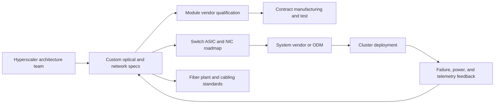
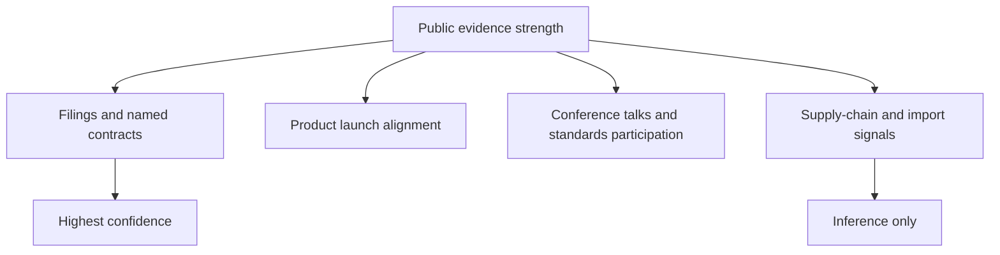

# Hyperscaler Optical Strategies
> **Last Updated:** 2026-06-30
> **Status:** In Review
> **Tags:** hyperscalers, cloud, suppliers, custom-silicon, OCS, SONiC

## Overview
Hyperscalers shape optical demand through topology, switch/NIC design, qualification, deployment cadence, and direct sourcing. Public disclosures reveal architecture and selected capacity commitments but rarely complete module allocations, internal PIC work, or CPO schedules.

The strongest current supplier evidence is upstream: Meta and Amazon have disclosed large Corning fiber/connectivity agreements, while NVIDIA has disclosed investments and purchase/capacity arrangements with Coherent and Lumentum. Finished-transceiver allocations remain less transparent and must be separated from analyst inference.

> ⚠️ Note: An investment, testimonial, interoperability demo, or customer list does not prove production revenue for a specific optical SKU.

## Key Findings / Highlights
- [CONFIRMED] Google’s Jupiter and production optical-circuit-switching publications demonstrate long-running topology and OCS integration [Source: Google/SIGCOMM, 2015-2022].
- [CONFIRMED] Meta signed a multiyear Corning agreement worth up to $6B for US datacenter fiber, cable, and connectivity through 2030 [Source: Meta/Corning agreement coverage, 2026].
- [CONFIRMED] Amazon announced a multibillion-dollar Corning fiber/connectivity agreement on June 8, 2026 [Source: Amazon/Corning agreement coverage, 2026-06-08].
- [CONFIRMED] NVIDIA committed $2B each to Coherent and Lumentum and entered nonexclusive purchase/capacity arrangements [Source: company announcement coverage, 2026-03].
- [ESTIMATED] Public evidence is strongest where long-lead fiber and laser capacity requires contractual commitments; module awards are usually confidential [HIGH confidence].

## Visual Guide

## Detailed Content
### Hyperscaler Strategy Matrix
| Hyperscaler | Internal Network Program | Optical Strategy | Confirmed Supplier Evidence | Custom Silicon | CPO / Optical Signal |
|---|---|---|---|---|---|
| Google | Jupiter; production OCS | custom topology, OCS, high-radix fabrics, DCI | custom-silicon relationships public; optical allocation unresolved | TPU and network silicon programs | strong internal capability; merchant CPO suppliers undisclosed |
| Meta | FBOSS, Minipack, Voyager, Cassini | open systems, coherent DCI, OCP specifications | Corning up to $6B through 2030 | MTIA and network co-design | ecosystem participation; internal CPO status undisclosed |
| Microsoft | Azure DCI, SONiC | disaggregation, coherent DCI, custom systems | AAOI relationship reported secondarily; exact SKU/volume confidential | Maia/Cobalt and network-silicon work | research/partnership signals |
| Amazon AWS | Nitro, EFA, Trainium/Inferentia | tightly integrated cloud/AI fabric | Corning multibillion agreement; AAOI relationship reported | extensive custom compute/NIC silicon | internal plan undisclosed |
| ByteDance | AI/cloud fabrics | high-volume 400G/800G sourcing | Broadcom CPO executive testimonial | limited public detail | support signal, not volume proof |
| Alibaba Cloud | HPN/cloud and AI silicon | domestic/global optical ecosystem | no high-confidence current map | custom cloud/AI silicon | [TO VERIFY] |
| Baidu | AI cloud and Kunlun clusters | high-bandwidth AI fabrics | no high-confidence current map | Kunlun AI silicon | [TO VERIFY] |
| NVIDIA / AI-cloud ecosystem | Spectrum-X, Quantum-X | vertically integrated AI networking | Coherent and Lumentum capacity; named system adopters | GPU, switch, NIC/DPU | named CPO systems and adopters |

### Evidence Scale
| Grade | Evidence Type | Meaning |
|---|---|---|
| A | signed agreement with value/capacity or official named adoption | direct relationship confirmed |
| B | supplier/customer identified in official filing or release | relationship confirmed; economics may be unknown |
| C | testimonial, qualification, or interoperability work | engagement signal, not purchase proof |
| D | analyst/channel inference | hypothesis only |

### Relationship Matrix
| Buyer / Platform | Supplier / Adopter | Layer | Evidence | Grade | Date / Term |
|---|---|---|---|---|---|
| Meta | Corning | fiber, cable, connectivity | up to $6B multiyear US agreement | A | announced 2026; through 2030 |
| Amazon | Corning | fiber, cable, connectivity | multibillion-dollar agreement and NC expansion | A | 2026-06-08 |
| NVIDIA | Coherent | advanced lasers/optical products | $2B investment plus purchase/capacity rights | A | 2026-03 |
| NVIDIA | Lumentum | advanced laser systems/optics | $2B investment plus purchase/capacity rights; new fab planned | A | 2026-03 |
| NVIDIA Quantum-X | TACC | CPO system adoption | named prospective adopter | A/B | 2025 disclosure; 2026+ deployment |
| NVIDIA Quantum-X | Oak Ridge National Laboratory | CPO system adoption | named prospective adopter | A/B | 2025 |
| NVIDIA Quantum-X | CoreWeave | CPO system adoption | named prospective adopter | A/B | 2025 |
| NVIDIA Quantum-X | Lambda | CPO system adoption | named prospective adopter | A/B | 2025 |
| Amazon / Microsoft / Oracle | AAOI | optical modules | named in secondary financial coverage; current SKU/volume confidential | B/C | 2025-2026 |
| ByteDance | Broadcom | CPO ecosystem | public executive testimonial | C | 2024 |
| Google | Broadcom | custom accelerator/network silicon | silicon relationship established; optical scope unproven | B for silicon; D for optics | ongoing |

### Architecture Case Studies
#### Google
| Program | Function | Optical Relevance |
|---|---|---|
| Jupiter | warehouse-scale Clos fabric | repeated bandwidth generations and custom control |
| production OCS | reconfigurable optical circuits | bypass/reconfigure electrical paths |
| TPU pods | accelerator clusters | drives scale-out and scale-across traffic |
| Aquila | prompt-supplied custom NIC reference | [TO VERIFY] exact public program and scope |

#### Meta
| Program | Contribution | Status |
|---|---|---|
| FBOSS | switch software | active open-source ecosystem |
| Voyager | open packet-optical transport | historical OCP/TIP platform |
| Cassini | modular packet/optical transponder | open ecosystem |
| coherent DCI | open line systems and pluggables | public direction; quantities undisclosed |

### Capacity Signals
| Agreement | Manufacturing Effect | Strategic Meaning |
|---|---|---|
| Meta-Corning | expanded Hickory, NC operation; Meta expected as major customer | long-duration US fiber/connectivity demand |
| Amazon-Corning | North Carolina expansion and approximately 1,000 jobs reported | second major hyperscaler capacity commitment |
| NVIDIA-Coherent | financed US manufacturing/R&D expansion | strategic laser and optical-product access |
| NVIDIA-Lumentum | new fabrication facility announced | strategic laser supply and future capacity access |

### Open Networking Implications
| Technology | Role | Optical Impact |
|---|---|---|
| SONiC | network OS disaggregation | broadens ODM ecosystem and module qualification |
| OpenConfig | vendor-neutral telemetry/configuration | consistent optical telemetry and automation |
| SAI | switch abstraction | separates NOS from ASIC SDK |
| CMIS | pluggable management | standardized module control and diagnostics |
| OCP designs | open hardware/system requirements | influences cages, thermals, telemetry, qualification |

### What Remains Inference
- A hyperscaler investor in an optical startup is not automatically a production customer.
- “Cloud customer” disclosures do not identify a buyer unless explicitly named.
- ODM and contract-manufacturing routes can obscure the ultimate customer.
- Direct laser/PIC sourcing can bypass finished-module vendors and cause double-counting.
- Qualification may precede volume revenue by multiple quarters.

## Data Tables (where applicable)
| Field | Value | Source | Date |
|---|---|---|---|
| Meta-Corning maximum | up to $6B | agreement coverage | 2026 |
| Amazon-Corning | multibillion-dollar | agreement coverage | 2026-06-08 |
| NVIDIA-Coherent investment | $2B | company coverage | 2026-03 |
| NVIDIA-Lumentum investment | $2B | company coverage | 2026-03 |
| Named Quantum-X adopters | TACC, ORNL, CoreWeave, Lambda | NVIDIA | 2025 |

## Open Questions / Gaps
- Obtain official minimum-purchase schedules and duration where public.
- Map module SKU/reach allocation without relying on rumor.
- Separate direct component sourcing from ODM and module-vendor revenue.
- Add China hyperscaler relationships from filings and official tenders.
- Track whether strategic capacity rights constrain supply for other buyers.

## References
- Google Research Publications | https://research.google/pubs/ | 2026-06-09
- Meta Engineering | https://engineering.fb.com/ | 2026-06-09
- Meta-Corning coverage | https://www.wsj.com/tech/meta-enters-up-to-6-billion-data-center-fiber-optic-cable-deal-with-corning-4a085f73 | 2026-06-09
- Amazon-Corning coverage | https://www.wsj.com/tech/amazon-enters-agreement-with-corning-for-optical-fiber-for-data-centers-352c7fa7 | 2026-06-09
- NVIDIA supplier coverage | https://www.wsj.com/tech/ai/nvidia-to-invest-2-billion-in-both-lumentum-and-coherent-b047f619 | 2026-06-09
- NVIDIA adoption coverage | https://www.itpro.com/infrastructure/nvidia-announces-new-supercomputers-and-an-open-model-family-for-science-at-sc-2025 | 2026-06-09
- Open Compute Project | https://www.opencompute.org/ | 2026-06-09
- SONiC | https://sonic-net.github.io/SONiC/ | 2026-06-09
