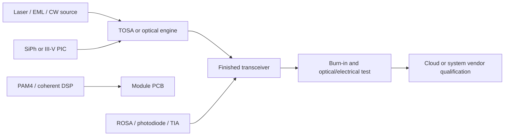
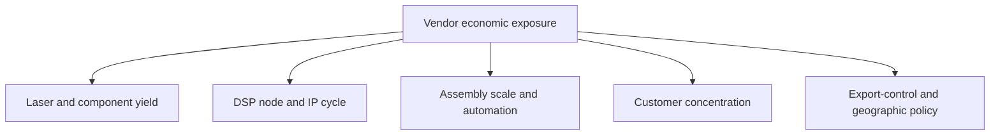

# Component Vendors
> **Last Updated:** 2026-06-30
> **Status:** Draft
> **Tags:** components, transceivers, lasers, DSP, manufacturing

## Overview
The component layer includes lasers, modulators, photodetectors, DSPs, SerDes, PICs, optical sub-assemblies, finished modules, and test equipment. Many suppliers span multiple layers, so revenue exposure must be estimated from segment disclosures rather than company names alone.

Customer concentration, China exposure, product-cycle timing, utilization, and mix can drive earnings more than aggregate market growth. Revenue below is a rough historical baseline and must be replaced with current LTM data [See: [20_investment_and_ma_tracker.md](20_investment_and_ma_tracker.md)].

> 🔄 Refresh Needed: High Priority — update all financials, ownership, tickers, and customer exposure from current filings.

## Key Findings / Highlights
- [CONFIRMED] II-VI adopted the Coherent Corp name after acquiring Coherent in 2022 [Source: Coherent filings, 2022].
- [CONFIRMED] Marvell acquired Inphi in 2021, adding PAM4 and coherent DSP assets [Source: Marvell, 2021].
- [CONFIRMED] Cisco completed its Acacia acquisition in 2021 [Source: Cisco, 2021].
- [CONFIRMED] Fabrinet is a major outsourced manufacturer for optical communications products.
- [ESTIMATED] InnoLight, Eoptolink, Accelink/HG Genuine, and Source Photonics are central to China-linked datacenter module supply, with exposure varying by customer and export rules.

## Visual Guide

### Official Visual References
Use these official pages for product photos, architecture diagrams, and investor-presentation visuals. Link to the pages directly unless image reuse rights are explicit.

| Vendor | Visual Material to Review | Official Source |
|---|---|---|
| Lumentum | datacom lasers, EMLs, coherent components, product-family images | https://www.lumentum.com/en/products |
| Coherent | datacenter transceivers, lasers, coherent components, SiPh-related product visuals | https://www.coherent.com/networking |
| Marvell | PAM4 and coherent DSP product diagrams and connectivity block diagrams | https://www.marvell.com/products/networking/optical-dsp.html |
| InnoLight | 400G/800G/1.6T module product photos and form-factor examples | https://www.innolight.com/en |
| Fabrinet | contract-manufacturing and precision optical assembly context | https://investor.fabrinet.com/ |
| Viavi | optical and high-speed electrical test workflow diagrams | https://www.viavisolutions.com/en-us/solutions/high-speed-network-test |

## Detailed Content
### Vendor Matrix
| Company | Ticker | HQ | Key Products | Core Technology | Primary Customers | Revenue Baseline ($M) | DC Optical Exposure % | Notes |
|---|---|---|---|---|---|---:|---:|---|
| Coherent Corp | COHR | US | lasers, transceivers, coherent components, materials | III-V, SiPh, optics | cloud, telecom, industrial | ~4,700 FY2024 [TO VERIFY] | [ESTIMATED] 25-40% | includes former II-VI |
| Lumentum | LITE | US | EMLs, coherent components, lasers | InP/laser integration | module/system vendors | ~1,400 FY2024 [TO VERIFY] | [ESTIMATED] 20-35% | customer/mix volatility |
| Applied Optoelectronics | AAOI | US | datacenter/CATV modules | lasers and transceivers | hyperscalers, CATV | ~217 FY2023 | [ESTIMATED] 50-75% | concentrated customers |
| Fabrinet | FN | Thailand/US | contract manufacturing | precision optical assembly | optical OEMs | ~2,900 FY2024 [TO VERIFY] | [ESTIMATED] 50-70% | outsourced manufacturing proxy |
| Marvell | MRVL | US | PAM4 DSP, SerDes, coherent DSP | advanced CMOS mixed signal | module and system vendors | ~5,500 FY2024 [TO VERIFY] | [ESTIMATED] 10-20% direct optics | Inphi portfolio |
| Cisco / Acacia | CSCO | US | coherent DSP/modules | coherent DSP, SiPh | carriers, cloud | consolidated | not disclosed | vertically integrated |
| InnoLight | private | China | 400G/800G modules | module integration, SiPh/EML sourcing | hyperscalers | private | high | major scale supplier |
| Eoptolink | 300502.SZ | China | datacenter transceivers | module integration | cloud/network OEMs | [TO VERIFY] | high | China listed |
| HG Genuine / Huagong Tech | 000988.SZ | China | transceivers/components | optical modules | cloud/telecom | [TO VERIFY] | medium-high | subsidiary structure |
| Source Photonics | private | US/China | datacenter and access optics | lasers/modules | cloud/telecom | private | medium-high | ownership [TO VERIFY] |
| Accelink | 002281.SZ | China | modules/components | active/passive optics | telecom/cloud | [TO VERIFY] | medium | broad portfolio |
| Viavi Solutions | VIAV | US | test and measurement | optical/electrical test | vendors/operators | ~1,000 FY2024 [TO VERIFY] | indirect | cycle enabler |

> ⚠️ Note: Revenue periods, currencies, and fiscal years are not normalized. “DC optical exposure” is an analytical estimate, not company guidance.

### Value Chain Position
| Layer | Representative Vendors | Economic Driver |
|---|---|---|
| Lasers/EMLs | Lumentum, Coherent, Sumitomo, Mitsubishi | yield, bandwidth, reliability |
| DSP/SerDes | Marvell, Broadcom, Cisco/Acacia | process node, IP, interoperability |
| PICs/engines | Intel, Coherent, Cisco, InnoLight ecosystem | integration and packaging |
| Module assembly | InnoLight, Eoptolink, AAOI, Source Photonics | scale, automation, qualification |
| Contract manufacturing | Fabrinet, FIT, Benchmark | utilization and customer mix |
| Test | Viavi, Keysight, Anritsu | interface generation transitions |

### Monitoring KPIs
- 800G and 1.6T unit shipments and average selling price.
- EML and CW-laser capacity/utilization.
- Top-customer revenue concentration.
- Cloud versus telecom revenue mix.
- Inventory days and purchase commitments.
- China export-control and entity-list exposure.

## Data Tables (where applicable)
| Field | Value | Source | Date |
|---|---|---|---|
| II-VI/Coherent close | ~$5.7B transaction value | company announcement | 2022 |
| Marvell/Inphi close | ~$10B announced value | Marvell | 2021 |
| Cisco/Acacia close | ~$4.5B purchase consideration | Cisco | 2021 |
| Leading-edge module speed | 800G volume; 1.6T emerging | vendor products | 2024-2025 |
| Key outsourced manufacturer | Fabrinet | company filings | 2024 |

## Open Questions / Gaps
- Replace estimated revenue/exposure with standardized LTM segment models.
- Resolve private-company ownership and funding.
- Map supplier-to-hyperscaler relationships using defensible sources.
- Add unit, ASP, gross-margin, and capacity history by product generation.
- Track export restrictions and customer concentration quarterly.

## References
- Coherent Investor Relations | https://investors.coherent.com/ | 2026-06-09
- Lumentum Investor Relations | https://investor.lumentum.com/ | 2026-06-09
- Marvell Investor Relations | https://investor.marvell.com/ | 2026-06-09
- Fabrinet Investor Relations | https://investor.fabrinet.com/ | 2026-06-09
- Cisco Acacia | https://newsroom.cisco.com/ | 2026-06-09
- SEC EDGAR | https://www.sec.gov/edgar/search/ | 2026-06-09
