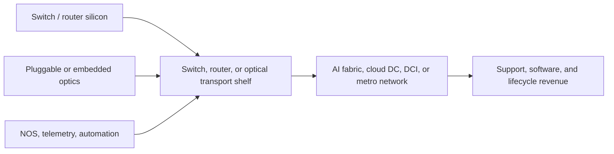
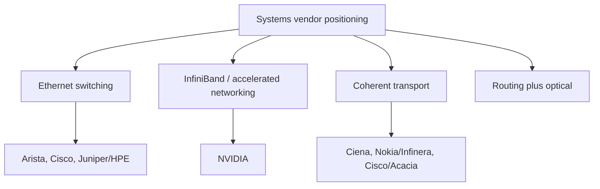

# Systems Vendors
> **Last Updated:** 2026-06-30
> **Status:** Draft
> **Tags:** switching, routing, optical-transport, AI-networking, systems

## Overview
Systems vendors monetize optics through Ethernet/InfiniBand switching, routing, coherent transport, network operating systems, and integrated support. Datacenter switching vendors benefit from AI scale-out bandwidth, while optical transport vendors benefit from DCI and metro capacity.

Revenue splits are not consistently disclosed. The database therefore separates confirmed segment reporting from estimated AI/datacenter exposure and tracks customer concentration and backlog as independent risk indicators.

> 🔄 Refresh Needed: High Priority — update Nokia/Infinera and HPE/Juniper transaction status plus current AI revenue commentary.

## Key Findings / Highlights
- [CONFIRMED] Arista is highly exposed to cloud/datacenter Ethernet and disclosed material customer concentration in public filings [Source: Arista 10-K, 2024].
- [CONFIRMED] Cisco combines Nexus, Silicon One, optics, and Acacia coherent technology.
- [CONFIRMED] HPE announced an agreement to acquire Juniper Networks in January 2024; current closing status requires verification.
- [CONFIRMED] Nokia announced an agreement to acquire Infinera in June 2024; current closing/integration status requires verification.
- [ESTIMATED] AI revenue attribution is not comparable across vendors because definitions include systems, optics, routing, and software differently.

## Visual Guide

### Official Visual References
Use these official pages for system photos, architecture diagrams, and roadmap visuals. Link to the pages directly unless image reuse rights are explicit.

| Vendor | Visual Material to Review | Official Source |
|---|---|---|
| NVIDIA | Spectrum-X Ethernet architecture, accelerated networking diagrams, switch platform visuals | https://www.nvidia.com/en-us/networking/ethernet/spectrum-x/ |
| Broadcom | Tomahawk / StrataXGS switch silicon positioning and platform diagrams | https://www.broadcom.com/products/ethernet-connectivity/switching/strataxgs |
| Ciena | WaveLogic coherent engine visuals, DCI architecture diagrams, system portfolio graphics | https://www.ciena.com/products/wavelogic |
| Arista | 800G cloud networking solution diagrams and switch-family visuals | https://www.arista.com/en/solutions/800g |
| Cisco | Silicon One architecture visuals and routed-optical/coherent context | https://www.cisco.com/site/us/en/products/networking/silicon-one/index.html |
| Nokia | Photonic Service Engine visuals and optical transport architecture graphics | https://www.nokia.com/networks/ip-networks/photonic-service-engine/ |

## Detailed Content
### Vendor Matrix
| Company | Ticker | Key Products | DC vs Telecom Revenue Split | AI/DC Growth Signal | Key Customers | Notes |
|---|---|---|---|---|---|---|
| Arista Networks | ANET | 7000/7800 switching, EOS | predominantly cloud/enterprise DC | strong AI Ethernet commentary | cloud titans, enterprise | customer concentration material |
| Cisco | CSCO | Nexus, Silicon One, Acacia, routers | diversified | AI networking backlog/orders disclosed periodically | cloud, enterprise, service provider | broad vertical stack |
| Juniper Networks | JNPR | QFX, PTX, Apstra | mixed DC/service provider | AI data-center positioning | cloud, enterprise, carrier | HPE deal [TO VERIFY status] |
| HPE | HPE | Aruba, HPC systems, networking | enterprise/HPC | systems-level AI exposure | enterprise/public sector | proposed Juniper acquisition |
| Ciena | CIEN | WaveLogic, 6500, Waveserver, Blue Planet | carrier-heavy with cloud/DCI | cloud provider demand and backlog | carriers, cloud | coherent leader |
| Nokia | NOK | 1830, PSE, routers | carrier-heavy | DCI and coherent growth | carriers/cloud | Infinera deal [TO VERIFY] |
| Ribbon Communications | RBBN | Apollo optical, IP/edge | carrier/edge-heavy | limited direct AI signal | carriers | smaller scale |
| Infinera | INFN [historical] | ICE, GX, optical engines | optical transport | DCI opportunity | carriers/cloud | acquisition announced by Nokia |

### Product Layer Comparison
| Layer | Arista | Cisco | Juniper/HPE | Ciena | Nokia/Infinera |
|---|---|---|---|---|---|
| DC Ethernet switching | core | core | core | limited | limited |
| Merchant/custom ASIC | merchant-heavy | Silicon One + merchant | merchant/custom mix | coherent DSP | routing + coherent DSP |
| Coherent optics | partner ecosystem | Acacia | pluggables/partners | WaveLogic | PSE + ICE |
| Optical line systems | limited | routed optical | PTX/optical partnerships | core | core |
| Network automation | CloudVision/EOS | controllers/IOS-XR | Apstra/JunOS | Blue Planet | NSP |

### KPIs to Track
| KPI | Why It Matters |
|---|---|
| AI networking revenue/orders | direct demand signal, but definition-sensitive |
| Cloud customer concentration | upside and procurement risk |
| Deferred revenue/backlog | visibility and cancellation risk |
| 400G/800G port shipments | generation transition |
| Optical attach rate | systems revenue captured per port |
| Gross margin | product mix and supply pressure |

### Transaction Context
| Transaction | Announced Value | Date | Status |
|---|---:|---:|---|
| HPE / Juniper | ~$14B equity value | 2024-01 | [TO VERIFY current] |
| Nokia / Infinera | ~$2.3B enterprise value | 2024-06 | [TO VERIFY current] |

## Data Tables (where applicable)
| Field | Value | Source | Date |
|---|---|---|---|
| Arista core exposure | cloud/datacenter networking | Arista filings | 2024 |
| Cisco coherent asset | Acacia | Cisco | acquired 2021 |
| Ciena DSP family | WaveLogic | Ciena | active 2024 |
| Nokia DSP family | Photonic Service Engine | Nokia | active 2024 |
| Infinera DSP/PIC family | ICE | Infinera | active 2024 |

## Open Questions / Gaps
- Normalize AI revenue definitions across systems vendors.
- Update transaction close, remedies, and integration milestones.
- Build quarterly 800G port and optical attach-rate estimates.
- Quantify DCI versus traditional carrier exposure.
- Track top-customer concentration and direct hyperscaler relationships.

## References
- Arista Investor Relations | https://investors.arista.com/ | 2026-06-09
- Cisco Investor Relations | https://investor.cisco.com/ | 2026-06-09
- HPE Investor Relations | https://investors.hpe.com/ | 2026-06-09
- Juniper Investor Relations | https://investor.juniper.net/ | 2026-06-09
- Ciena Investor Relations | https://investor.ciena.com/ | 2026-06-09
- Nokia Investor Relations | https://www.nokia.com/about-us/investors/ | 2026-06-09
