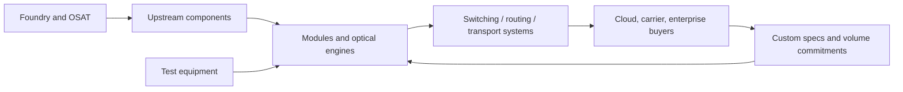
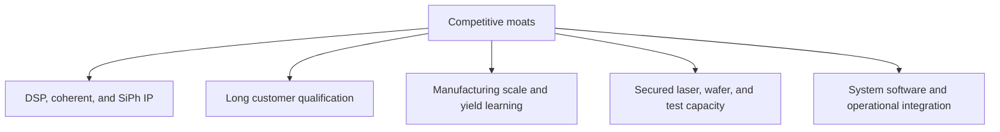

# Competitive Landscape
> **Last Updated:** 2026-06-30
> **Status:** Draft
> **Tags:** competition, margins, moats, M-and-A, value-chain

## Overview
Optical networking combines concentrated IP-intensive upstream layers with fiercely competitive module assembly and powerful hyperscaler buyers. Profit pools migrate with each technology transition: suppliers with scarce lasers, DSPs, packaging yield, or qualified high-speed products can earn temporary premiums before multi-sourcing and volume pricing compress margins.

Vertical integration can reduce interface power and accelerate co-design, but it also increases capital, execution, and customer-channel conflict. Merchant suppliers retain value when they spread R&D across many customers and offer interoperability [See: [09_vendors_components.md](09_vendors_components.md)].

## Key Findings / Highlights
- [ESTIMATED] DSP/SerDes and specialized laser layers generally have stronger IP moats than module assembly [MED confidence].
- [CONFIRMED] Hyperscaler concentration creates buyer power through qualification, volume negotiation, and second-source requirements.
- [CONFIRMED] Marvell/Inphi, Cisco/Acacia, II-VI/Coherent, NVIDIA/Mellanox, and Nokia/Infinera illustrate vertical-integration logic.
- [ESTIMATED] Gross margins vary more by mix and utilization than by nominal layer; ranges below are directional.
- [CONFIRMED] CPO shifts value from replaceable modules toward ASIC, packaging, optical-engine, and system integration.

## Visual Guide

## Detailed Content
### Porter’s Five Forces
| Force | Intensity | Evidence |
|---|---|---|
| Rivalry | High | rapid generations, pricing, many module vendors |
| Buyer power | High | few hyperscalers/system OEMs and qualification leverage |
| Supplier power | Medium-high | scarce DSP nodes, EMLs, packaging/test capacity |
| New entrants | Medium | foundry access helps, but qualification/IP/capital are barriers |
| Substitutes | Medium | DAC/AEC, LPO, CPO, topology changes substitute by reach |

### Value Chain and Margin Structure
| Layer | Representative Companies | Gross Margin Range | Competitive Intensity | Moat Type |
|---|---|---:|---|---|
| Photonics IP/design | Ayar, Intel, Cisco, imec ecosystem | 40-70% potential | medium | patents, talent, architecture |
| SiPh foundry | GF, TSMC, Tower | 25-50% [ESTIMATED] | medium | process, PDK, scale |
| DSP/ASIC | Marvell, Broadcom, Cisco | 50-70% | medium | IP, node access, software |
| Laser/EML | Lumentum, Coherent, Japanese suppliers | 30-50% | medium-high | epi/fab yield and reliability |
| Transceiver module | InnoLight, Eoptolink, AAOI | 15-35% | high | scale, automation, qualification |
| System integration | Arista, Cisco, NVIDIA | 55-70% for leading platforms | high | software, ASIC, customer lock-in |
| Hyperscaler | Google, Meta, Microsoft, AWS | not comparable | concentrated | scale, data, workload control |

> ⚠️ Note: Ranges combine different fiscal periods and business mixes and must not be used as valuation comps without normalization.

### Competitive Moats
| Moat | Evidence | Durability Risk |
|---|---|---|
| IP breadth | device/DSP/package patent families | design-around and expiry |
| Foundry access | leading-node allocation and qualified process | capacity cycles, second sources |
| Co-design relationship | early access to switch/host channels | customer insourcing |
| Qualification | field reliability and firmware interoperability | generation reset |
| Vertical integration | control of laser-PIC-DSP-package | complexity and fixed cost |
| Manufacturing yield | automation and process learning | knowledge transfer and price pressure |

### M&A History
| Year | Acquirer | Target | Price ($M) | Multiple | Strategic Rationale |
|---:|---|---|---:|---|---|
| 2015 | Cisco | TE SubCom | [TO VERIFY] | [TO VERIFY] | subsea/optical asset transaction details need correction |
| 2019 | NVIDIA | Mellanox | 6,900 | [TO VERIFY] | high-performance networking |
| 2019 | Intel | Barefoot Networks | undisclosed | n/a | programmable switching |
| 2021 | Cisco | Acacia | ~4,500 | [TO VERIFY] | coherent DSP/modules |
| 2021 | Marvell | Inphi | ~10,000 | [TO VERIFY] | PAM4/coherent silicon |
| 2022 | II-VI | Coherent | ~5,700 | [TO VERIFY] | lasers/materials/vertical integration |
| 2024 | Nokia | Infinera | ~2,300 EV announced | [TO VERIFY] | scale in optical transport |

> ⚠️ Note: The requested “Cisco/TE SubCom” entry may conflate transactions. Cisco sold its optical systems business to Bookham in 2002; TE Connectivity later sold SubCom to Cerberus in 2018. Validate before using.

### Make vs Buy
| Function | Hyperscaler Incentive to Make | Merchant Advantage |
|---|---|---|
| Topology/control software | workload optimization | limited |
| NIC/switch ASIC | differentiation and scale | shared R&D and ecosystem |
| Optical module specification | cost/qualification control | multi-customer learning |
| PIC/DSP | power and integration | deep specialist IP |
| Manufacturing | supply assurance | yield, labor, capital efficiency |

## Data Tables (where applicable)
| Field | Value | Source | Date |
|---|---|---|---|
| Largest listed optics-related deal | Marvell/Inphi ~$10B | company announcement | 2020-2021 |
| NVIDIA/Mellanox | $6.9B | NVIDIA | 2020 close |
| Cisco/Acacia | ~$4.5B | Cisco | 2021 close |
| II-VI/Coherent | ~$5.7B | Coherent | 2022 close |
| Nokia/Infinera | ~$2.3B EV announced | Nokia | 2024 |

## Open Questions / Gaps
- Normalize transaction values and EV/revenue multiples at announcement.
- Replace directional margin ranges with segment-level public comps.
- Correct and source the Cisco/TE SubCom history.
- Quantify hyperscaler direct sourcing and custom-silicon displacement.
- Model profit-pool migration under pluggable, LPO, and CPO scenarios.

## References
- Company merger announcements and SEC filings | https://www.sec.gov/edgar/search/ | 2026-06-09
- NVIDIA Mellanox | https://nvidianews.nvidia.com/ | 2026-06-09
- Cisco Acacia | https://newsroom.cisco.com/ | 2026-06-09
- Marvell Inphi | https://investor.marvell.com/ | 2026-06-09
- Nokia Infinera | https://www.nokia.com/about-us/news/releases/ | 2026-06-09
