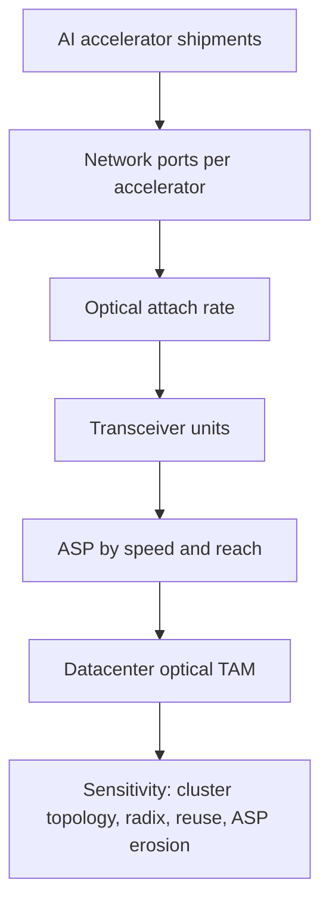
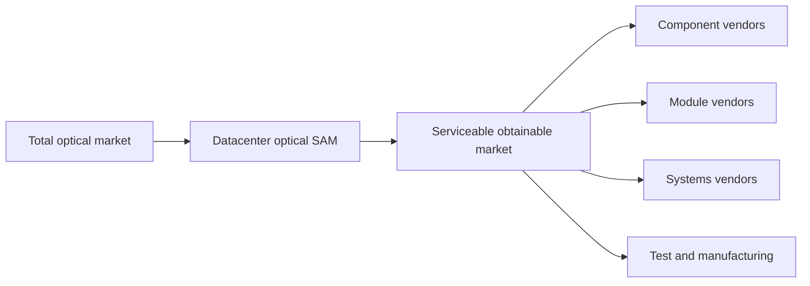

# Market Sizing
> **Last Updated:** 2026-06-30
> **Status:** In Review
> **Tags:** TAM, forecast, transceivers, CPO, AI-optics

## Overview
Market estimates differ because some count finished transceivers, components, telecom plus datacom, coherent modules, switching systems, or total datacenter investment. This section separates addressable-market scope, forecast object, units, and publication vintage rather than blending incompatible figures.

Licensed LightCounting, Dell'Oro, Omdia, Cignal AI, and IDTechEx tables were not available in the repository. Public statements are recorded below, while the initial dollar ranges remain analytical scenarios until licensed source definitions can be imported.

> ⚠️ Note: A $90B broad optical TAM, datacenter-transceiver revenue, AI back-end switch sales, and global datacenter capex are different markets and must not be added together. Segment ranges overlap.

## Key Findings / Highlights
- [CONFIRMED] Dell'Oro reported Ethernet represented roughly two-thirds of AI back-end switch sales in 1Q 2026 [Source: Dell'Oro, 2026-06-02].
- [CONFIRMED] Public Dell'Oro commentary places majority AI back-end ports at 800G in 2026, 1.6T in 2027, and 3.2T in 2029 [Source: Dell'Oro commentary reported 2025].
- [CONFIRMED] Omdia forecast global datacenter investment approaching $1.6T by 2030 and more than $600B of 2026 deployment by leading technology enterprises [Source: Omdia, 2026-05-28].
- [CONFIRMED] Lumentum management presented a broad optical TAM reaching about $90B by 2030, implying roughly 40% CAGR from 2025 [Source: Lumentum OFC investor briefing coverage, 2026-03-19].
- [ESTIMATED] Finished datacenter transceivers are a materially smaller subset than the broad optical-content TAM [HIGH confidence].

## Visual Guide

## Detailed Content
### Forecast Evidence Register
| Source | Metric | Period | Scope | Public Value | Confidence |
|---|---|---|---|---:|---|
| Dell'Oro | AI back-end switch sales by protocol | 1Q 2026 actual | Ethernet + InfiniBand switches | Ethernet ~two-thirds | HIGH, public release |
| Dell'Oro | majority port speed | 2026/2027/2029 forecast | AI back-end switch ports | 800G / 1.6T / 3.2T | MED, public summary |
| Omdia | global datacenter investment | 2030 forecast | facilities + infrastructure; broader than networking | ~$1.6T | MED; definition needed |
| Omdia | leading-enterprise deployment | 2026 forecast | AI infrastructure investment | >$600B | MED, public release |
| Lumentum | broad optical TAM | 2030 management TAM | optical/photonics opportunity | ~$90B; ~40% 2025-30 CAGR | MED, company-defined |
| LightCounting | Ethernet transceiver units/revenue | licensed | modules by speed/reach | [LICENSED DATA REQUIRED] | unavailable |
| Cignal AI / Omdia | coherent pluggables | licensed | ZR/ZR+/transport | [LICENSED DATA REQUIRED] | unavailable |
| IDTechEx | SiPh/CPO | licensed | components/platforms | [LICENSED DATA REQUIRED] | unavailable |

### Scope Hierarchy
| Level | Included | Excluded / Overlap Warning |
|---|---|---|
| Global datacenter investment | buildings, power, cooling, compute, network | not an optics TAM |
| Networking systems | switches, routers, NICs, optical transport | mostly system value |
| Optical interconnect TAM | lasers, PICs, DSPs, modules, fiber/connectivity | components can be embedded in modules |
| Finished transceivers | pluggable and embedded optical modules | excludes external fiber and host systems |
| Datacenter transceivers | Ethernet/InfiniBand/DCI subset | define coherent DCI and AOC inclusion |
| CPO/optical I/O | engines, chiplets, lasers, packages | can substitute for pluggables |

### Analytical TAM / SAM Baseline
| Segment | 2024A ($B) | 2025E ($B) | 2027E ($B) | 2030E ($B) | CAGR 2024-30 | Source | Confidence |
|---|---:|---:|---:|---:|---:|---|---|
| Total optical transceivers | 11-16 | 13-19 | 18-27 | 25-40 | 15-17% midpoint | public synthesis | LOW |
| Datacenter transceivers | 7-10 | 9-13 | 13-19 | 17-27 | 16-18% midpoint | public synthesis | LOW |
| SiPh components/modules | 2-4 | 3-5 | 5-9 | 9-16 | 25%+ | industry synthesis | LOW |
| CPO / optical I/O | <0.2 | <0.5 | 1-3 | 4-10 | not meaningful | roadmap scenario | LOW |
| Coherent pluggables | 1-2 | 1.5-2.5 | 2.5-4.5 | 4-7 | ~20% | public synthesis | LOW |
| Optical switches / OCS | <1 | <1 | 1-2 | 2-5 | 20%+ | public summaries | LOW |
| Datacenter fiber/cable | 2-4 | 2.5-4.5 | 3.5-6 | 5-9 | 14-16% | public synthesis | LOW |

> ⚠️ Note: These ranges are not additive. SiPh and DSP content can be embedded in transceiver revenue, coherent overlaps total modules, and fiber/cable definitions vary.

### Reconciled Technology Frame
| Segment | 2026 Direction | 2030 Treatment | Evidence Rule |
|---|---|---|---|
| 800G pluggables | volume growth and majority AI port speed | matures with ASP erosion | unit x ASP model |
| 1.6T pluggables | qualification/early ramp | major replacement generation | align with 102.4T switches |
| 3.2T | standards/R&D | early deployment around 2029 plausible | no near-term revenue without product evidence |
| CPO/NPO | early systems/design wins | scenario-sensitive | model substitution against pluggables |
| 800ZR/1600ZR | 800ZR ecosystem build | DCI growth and 1.6T transition | modules separate from line systems |
| Fiber/connectivity | capacity expansion | port/fiber-count growth | exclude from module ASP |

### Datacenter Transceiver Scenarios
| Scenario | 2024 Base ($B) | 2030 ($B) | CAGR | Key Assumptions |
|---|---:|---:|---:|---|
| Bear | 8.0 | 14 | ~10% | AI digestion, price erosion, copper/LPO substitution |
| Base | 8.5 | 21 | ~16% | sustained AI build; orderly 800G/1.6T transition |
| Bull | 9.0 | 30 | ~22% | 100K+ accelerator clusters, high optical attach, limited ASP erosion |

### Growth Drivers
| Driver | Mechanism | Leading Indicator |
|---|---|---|
| AI training | more east-west links | accelerator shipments and network radix |
| inference scale-out | distributed serving/storage traffic | deployment architecture and token demand |
| 800G upgrade | port ASP and bandwidth uplift | 51.2T switch shipments |
| 1.6T transition | next content cycle | 102.4T switch and 200G/lane qualification |
| DCI expansion | inter-campus capacity | cloud regions and coherent ports |
| fiber-rich topology | more optical links per endpoint | topology and oversubscription |

### AI Optical Attachment Model
| Variable | Formula / Unit | Notes |
|---|---|---|
| Optical spend per accelerator | optical revenue / deployed accelerators | define deployment year and endpoint count |
| Optical bandwidth per accelerator | aggregate optical Tb/s / accelerator | topology-dependent |
| Links per accelerator | optical endpoints / accelerator | includes tiers and redundancy |
| Module ASP | module revenue / units | mix-sensitive |
| Replacement factor | annual modules / installed ports | failures, upgrades, sparing |

Illustrative only: four 800G endpoints per accelerator at $800 per endpoint imply $3,200 optical content per accelerator [ESTIMATED]. Actual architectures may be materially lower or higher.

### Licensed Data Intake Template
| Required Field | Example |
|---|---|
| Report/source | LightCounting Ethernet Optics |
| Publication vintage | 2H 2026 |
| Geography | worldwide |
| Product boundary | modules only; excludes AOC |
| Datacom/telecom split | explicit |
| Actual/estimate years | 2025A / 2026E-2031E |
| Units/revenue | units, ASP, $M |
| Speed/reach/form factor | 800G DR8, 1.6T DR8, etc. |
| Revision history | prior forecast and delta |

## Data Tables (where applicable)
| Field | Value | Source | Date |
|---|---|---|---|
| Ethernet AI back-end share | ~two-thirds | Dell'Oro | 1Q 2026 |
| Majority speed sequence | 800G / 1.6T / 3.2T | Dell'Oro | 2026 / 2027 / 2029E |
| Global datacenter investment | approaches $1.6T | Omdia | 2030E |
| Leading-enterprise deployment | >$600B | Omdia | 2026E |
| Broad optical TAM | ~$90B | Lumentum management | 2030E |

## Open Questions / Gaps
- Import licensed unit, revenue, ASP, speed, and reach tables with definitions.
- Resolve the component boundaries in Lumentum's $90B TAM.
- Build actual 2025A and quarterly 2026 unit x ASP forecasts.
- Model CPO as substitution versus incremental content.
- Archive forecast vintages and calculate source forecast error.

## References
- Dell'Oro News Room | https://www.delloro.com/news/ | 2026-06-09
- Dell'Oro speed coverage | https://www.itpro.com/infrastructure/networking/why-networking-is-just-as-important-as-compute-in-ai-data-centers | 2026-06-09
- Omdia Newsroom | https://omdia.tech.informa.com/pr | 2026-06-09
- Lumentum OFC TAM coverage | https://www.investors.com/news/technology/lumentum-stock-lite-ofc-nvidia-gtc-optical-demand/ | 2026-06-09
- LightCounting | https://www.lightcounting.com/ | 2026-06-09
- Cignal AI | https://cignal.ai/ | 2026-06-09
- IDTechEx | https://www.idtechex.com/ | 2026-06-09
