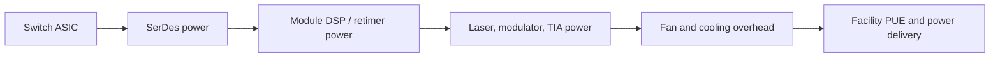
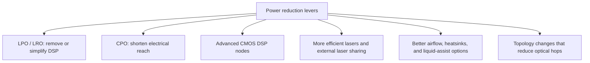

# Power and Thermal
> **Last Updated:** 2026-06-30
> **Status:** In Review
> **Tags:** power, thermal, pJ-per-bit, liquid-cooling, LPO, CPO

## Overview
Optical power must be measured at a declared boundary: device, engine, module, port, switch I/O, complete switch, or facility. Module-only comparisons can omit host SerDes, retimers, external lasers, regulators, pumps, fans, and redundancy.

Public 2025-2026 CPO comparisons are primarily vendor models rather than independent production measurements. No open, reproducible third-party dataset was found comparing equivalent 102.4T pluggable, LPO, NPO, and CPO switches under the same traffic, reach, temperature, cooling, FEC, and redundancy conditions.

> ⚠️ Note: The absence of independent like-for-like data is a material finding. Vendor figures are retained as architecture evidence but are not labeled measured full-system results without test methodology.

## Key Findings / Highlights
- [CONFIRMED] NVIDIA compares about 30 W per 800G pluggable port with about 9 W for its CPO design, consistent with its 3.5x efficiency claim [Source: NVIDIA disclosures, 2025].
- [CONFIRMED] NVIDIA cited electrical-channel loss falling from roughly 22 dB to 4 dB [Source: same].
- [CONFIRMED] Broadcom claimed Bailly's optical interconnect uses 70% less power than a pluggable alternative [Source: Broadcom, 2024].
- [ESTIMATED] Typical 800G DSP pluggables remain roughly 14-20 W for many module classes; reach and thermal envelope materially affect comparison [MED confidence].
- [ESTIMATED] CPO can reduce switch I/O energy, but complete-system savings depend on external lasers, control, cooling, redundancy, yield, and repair [HIGH confidence].

## Visual Guide




## Detailed Content
### Evidence Hierarchy
| Tier | Evidence | Use |
|---|---|---|
| 1 | independent instrumented system test | procurement and investment benchmark |
| 2 | vendor-measured datasheet under declared conditions | SKU comparison |
| 3 | vendor reference-design or modeled comparison | architecture planning |
| 4 | component/device simulation | R&D potential |
| 5 | unsourced marketing ratio | exclude |

### Published Comparison Register
| Source | Baseline | Alternative | Boundary | Result | Tier |
|---|---|---|---|---|---|
| NVIDIA | ~30 W/800G pluggable port | ~9 W/800G CPO port | switch optical-I/O path as presented | ~3.3x lower; marketed as 3.5x efficiency | 3 |
| NVIDIA | ~22 dB electrical loss | ~4 dB CPO loss | ASIC-to-optics electrical channel | 18 dB reduction | 3 |
| Broadcom Bailly | pluggable interconnect | CPO interconnect | optical-interconnect portion | 70% lower power claim | 3 |
| OIF 112G RTLR | fully retimed receive path | retimed TX / linear RX | module-interface architecture | receiver retiming block avoided | specification, not benchmark |

### Indicative Port Power and Normalization
| Case | Rate | Port Power | Energy | 64-Port Total | Caveat |
|---|---:|---:|---:|---:|---|
| NVIDIA pluggable comparison | 800G | 30 W | 37.5 pJ/bit | 1.92 kW | vendor high-power/future baseline |
| NVIDIA CPO comparison | 800G | 9 W | 11.25 pJ/bit | 576 W | shared blocks treated per vendor boundary |
| Typical 800G DSP pluggable | 800G | 14-20 W | 17.5-25 pJ/bit | 896-1,280 W | range, not one measured SKU |
| Estimated 1.6T pluggable | 1.6T | 20-30 W | 12.5-18.75 pJ/bit | 1.28-1.92 kW | roadmap range |
| Estimated 800G LPO | 800G | 8-12 W | 10-15 pJ/bit | 512-768 W | host burden omitted unless measured |

### System Power Stack
| Contributor | Pluggable | LPO | CPO |
|---|---|---|---|
| Host SerDes | long-reach/high power | high-quality linear host | short-reach/package target |
| Module DSP | present | removed/reduced | architecture-dependent |
| Drivers/TIAs | module | linear analog | optical engine |
| Laser | internal or external | internal or external | commonly shared external source |
| Thermal control | module | module | package/engine wavelength control |
| Cooling | faceplate air | faceplate air | package plus laser/pump loop |

### Full-System Boundary
| Include | Why |
|---|---|
| switch ASIC core | SerDes configuration and package thermals can change |
| host/package SerDes | primary electrical-reach saving |
| module or engine | direct conversion power |
| external laser source | often omitted from engine claims |
| regulators | architecture-dependent loss |
| fans, pumps, cold plates | cooling can offset component savings |
| heaters, control, telemetry | ring/wavelength stabilization |
| redundancy and spares | ELS and failed-engine tolerance |

### Facility Model
```text
Facility power delta = (optical delta + switch/SerDes delta + cooling delta)
                     x deployed systems
                     x PUE adjustment
```

NVIDIA's cited 400,000-GPU scenario compares roughly 72 MW for conventional networking with 21.6 MW for photonics. Treat it as a vendor scenario until topology, port count, reach mix, utilization, redundancy, and cooling assumptions are published in a reproducible model.

### Thermal Management
| Method | Benefit | Limitation |
|---|---|---|
| high-airflow heat sinks | mature and serviceable | fan power and air-temperature limits |
| heat pipes/vapor chambers | spreads hot spots | mechanical integration |
| cold plates | high heat removal | difficult at pluggable faceplate |
| immersion cooling | whole-system heat transfer | connector/material compatibility |
| rear-door heat exchanger | rack-level retrofit | local hot spots remain |
| external laser placement | separates laser heat | distribution loss and redundancy |

### Required Lab Procedure
| Variable | Required Control |
|---|---|
| rate/reach | same useful throughput and fiber reach |
| traffic | idle, 50%, and bidirectional line rate |
| BER/FEC | same post-FEC target and margin |
| temperature | same inlet, case, and coolant temperature |
| cooling | meter fans, pumps, and cold-plate loop |
| laser | include wall-plug power and redundant source |
| telemetry | separate ASIC, SerDes, optics, and regulators |
| reliability | include degraded/failure and repair modes |

### Procurement Benchmark Schema
| Field | Unit |
|---|---|
| Total switch input power | W |
| Useful throughput | Tb/s after coding overhead |
| System energy | pJ/useful bit |
| Optical subsystem power | W |
| Cooling power | W |
| Inlet/coolant temperature | °C |
| Reach and fiber loss | m/km and dB |
| Post-FEC BER | errors/bit |
| Repair model | replaceable unit and service time |

### Power Delivery and PUE
- Point-of-load regulation reduces distribution loss but adds package heat.
- High di/dt SerDes/DSP loads challenge power integrity and jitter.
- CPO package escape competes for electrical, optical, thermal, and mechanical area.
- Shared lasers require monitored redundant power and safe switching.
- Optics power directly increases IT load and indirectly increases cooling energy; PUE must not be applied without a defined boundary.

## Data Tables (where applicable)
| Field | Value | Source | Date |
|---|---|---|---|
| NVIDIA pluggable comparison | ~30 W/800G port | NVIDIA | 2025 |
| NVIDIA CPO comparison | ~9 W/800G port | NVIDIA | 2025 |
| NVIDIA channel loss | ~22 dB vs ~4 dB | NVIDIA | 2025 |
| Broadcom Bailly claim | 70% lower interconnect power | Broadcom | 2024 |
| Independent like-for-like data | not publicly found | research audit | 2026-06-09 |

## Open Questions / Gaps
- Obtain metered input power for shipping Bailly and Quantum-X/Spectrum-X systems.
- Allocate external-laser, pump, control, and cooling power consistently.
- Compare equivalent 102.4T pluggable, LPO, NPO, and CPO systems.
- Publish assumptions behind the 72 MW versus 21.6 MW scenario.
- Add failure-adjusted energy, repairability, and total cost.

## References
- NVIDIA Hot Chips roadmap coverage | https://www.tomshardware.com/networking/nvidia-outlines-plans-for-using-light-for-communication-between-ai-gpus-by-2026-silicon-photonics-and-co-packaged-optics-may-become-mandatory-for-next-gen-ai-data-centers | 2026-06-09
- Broadcom Bailly coverage | https://www.investors.com/news/technology/broadcom-stock-avgo-bailly-cpo-ethernet-switch-ai/ | 2026-06-09
- OIF Technical Work | https://www.oiforum.com/technical-work/ | 2026-06-09
- OSFP MSA | https://osfpmsa.org/ | 2026-06-09
- ASHRAE Data Centers | https://www.ashrae.org/technical-resources/bookstore/datacom-series | 2026-06-09
- The Green Grid | https://www.thegreengrid.org/ | 2026-06-09
