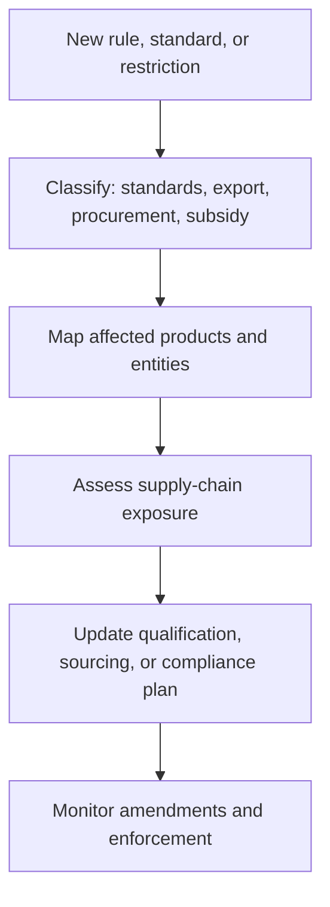
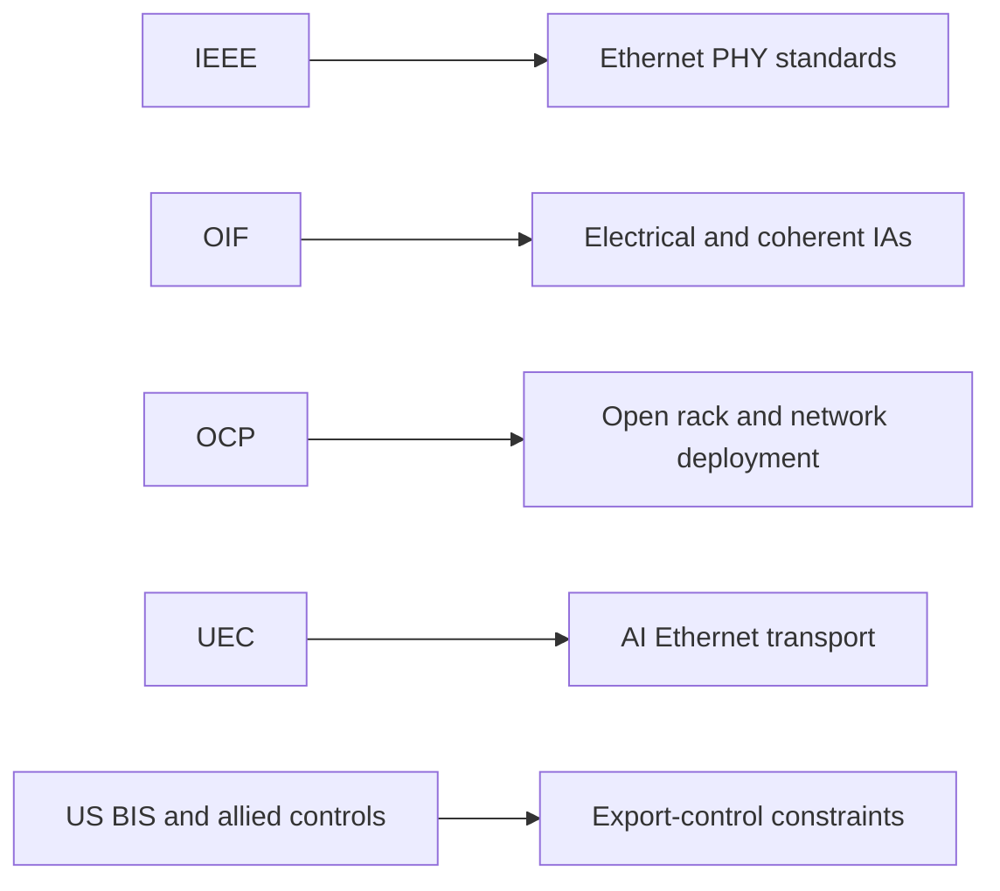

# Regulatory and Standards Bodies
> **Last Updated:** 2026-06-30
> **Status:** In Review
> **Tags:** IEEE, OIF, ETSI, ITU-T, OCP, UEC, export-controls

## Overview
Standards bodies coordinate interoperable Ethernet, electrical I/O, coherent optics, management, and network architecture. Regulatory policy independently affects trade, advanced-semiconductor access, design collaboration, cybersecurity, energy use, and domestic manufacturing.

Detailed IEEE/OIF technical project status belongs in [03_standards_and_msa.md](03_standards_and_msa.md). This section tracks institutional roles and regulation, with emphasis on the rapidly changing US export-control framework and its optical-supply-chain implications.

> ⚠️ Note: This tracker is informational, not legal advice. Classification depends on product specifications, destination, end user, end use, ownership, and effective date.

## Key Findings / Highlights
- [CONFIRMED] IEEE 802.3 and OIF remain the primary Ethernet and implementation-agreement bodies; current project details are consolidated in section `03`.
- [CONFIRMED] OCP publishes open networking hardware/software designs, while UEC targets Ethernet improvements for AI/HPC.
- [CONFIRMED] The January 2025 US AI Diffusion Rule was rescinded before implementation in May 2025; separate advanced-computing and semiconductor controls remained [Source: BIS, 2025-05].
- [CONFIRMED] China-oriented accelerator licensing and temporary 2025 EDA restrictions demonstrate that product and software policy can change on short notice.
- [CONFIRMED] CHIPS incentives and export controls affect the same supply chain in opposite directions: subsidizing selected domestic capacity while restricting selected transfers.

## Visual Guide

## Detailed Content
### Standards and Industry Bodies
| Body | Relevant Work | Datacenter Optical Role | Canonical Database Home |
|---|---|---|---|
| IEEE 802.3 | Ethernet PHY and media projects | 400G, 800G, 1.6T and electrical/optical interfaces | [03_standards_and_msa.md](03_standards_and_msa.md) |
| OIF | CEI/EEI, ZR, CMIS, CPO, ELS, NPO, compute optics | implementation agreements and interoperability | [03_standards_and_msa.md](03_standards_and_msa.md) |
| ITU-T SG15 | optical transport, interfaces, fiber | DCI/transport and fiber standards | this section |
| IETF | routing, congestion, YANG/telemetry | protocols and operations above optical PHY | this section |
| OCP | networking, hardware management, open systems | switch designs, NOS, optical operations | this section |
| UEC | AI/HPC Ethernet | transport, congestion, reliability, APIs | this section |
| UALink Consortium | accelerator interconnect | scale-up architecture and future optical extension | [18_AI_datacenter_architecture.md](18_AI_datacenter_architecture.md) |
| ETSI | NFV, MEC, sustainability | network and energy context | this section |

### OCP Initiatives
| Initiative | Role | Optical Relevance |
|---|---|---|
| SAI | switch abstraction interface | NOS/ASIC interoperability |
| FBOSS / SONiC ecosystem | open network software | module telemetry and qualification |
| Goldstone | open NOS for optical systems | coherent/open line systems |
| open switch designs | disaggregated hardware | cages, thermals, module standards |
| hardware management | telemetry/control | CMIS and failure operations |

### UEC and AI Networking
UEC membership includes cloud, semiconductor, systems, and networking companies. Its relationship to optics is indirect but material: congestion control, link rates, reliability, telemetry, and topology determine optical port count and utilization. Exact membership and roadmap dates should be imported from the official site rather than copied from static press articles.

### US Export-Control Timeline
| Date | Action | Current Interpretation |
|---|---|---|
| 2022-10 onward | advanced-computing, supercomputer, and semiconductor-manufacturing controls | foundational PRC restrictions remain relevant |
| 2024-12 | additional manufacturing controls and Entity List changes | equipment/technology restrictions tightened |
| 2025-01 | AI Diffusion Rule issued | [DEPRECATED] as operative framework; later rescinded |
| 2025-04 | H20 and related China-oriented accelerators subjected to licensing | direct AI-chip impact; indirect optical demand impact |
| 2025-05 | BIS announced rescission of AI Diffusion Rule | country-tier framework did not take effect as planned |
| 2025-05 to 2025-07 | temporary EDA/software restrictions and later relaxation reported | policy volatility for design collaboration |
| 2026 | licensing continues to evolve by chip, destination, parent/end user, and end use | transaction-specific legal review required |

### Optical Supply-Chain Exposure
| Item | Potential Control Hook | Required Action |
|---|---|---|
| advanced DSP/SerDes | ECCN/performance thresholds and advanced-computing rules | classify each SKU and destination |
| foundry tapeout/design data | technology/software and deemed-export rules | control access and screen personnel |
| high-end test equipment | CCL classification and end use | classify equipment and support |
| optical module shipment | module classification plus incorporated controlled chips | do not assume optics are uncontrolled |
| China customer/affiliate | Entity List, MEU, ownership/affiliate rules | screen parent and beneficial ownership |
| cloud access | advanced-computing end-use/location rules | review remote access and service model |

### Compliance Dataset
| Required Field | Example |
|---|---|
| legal entity and aliases | supplier, customer, parent |
| ownership | direct and indirect percentages |
| restricted-list screening | Entity List, SDN, MEU and relevant lists |
| ECCN / HTS | product-level classification |
| destination / end use | fab, cloud, military, research |
| license status | requirement, exception, authorization, expiration |
| rule effective date | preserve historical decisions |
| counsel approval | reviewer, date, document |

### China Industrial Policy
China's MIIT and national/local programs support optical communications, compound semiconductors, datacenters, and domestic substitution. Relevant vendors include InnoLight, Accelink, Eoptolink, HG Genuine, and Source Photonics-linked operations. Quantified substitution targets require original-language policy documents and should not be inferred from press summaries.

### CHIPS and Science Act
| Program | Relevance | Evidence Needed |
|---|---|---|
| CHIPS incentives | domestic fabs and packaging | award-by-award photonics allocation |
| National Semiconductor Technology Center | R&D and prototyping | photonics program scope |
| AIM Photonics | SiPh PDK, packaging, test, workforce | funding and capacity milestones |
| defense/dual-use programs | trusted photonics supply | contract-specific details |

### Monitoring Cadence
| Dataset | Frequency | Trigger |
|---|---|---|
| BIS and Federal Register rules | monthly and event-driven | new rule, FAQ, license-policy change |
| restricted-party lists | before each transaction and automated daily if operational | entity/ownership change |
| IEEE/OIF project status | monthly during ballot/IA development | draft, ballot, publication |
| OCP/UEC membership and roadmap | quarterly | release or conference |
| CHIPS awards | quarterly | award or facility milestone |

## Data Tables (where applicable)
| Field | Value | Source | Date |
|---|---|---|---|
| AI Diffusion Rule | rescinded before implementation | BIS | 2025-05 |
| Current IEEE/OIF detail | section 03 | repository convention | 2026-06-09 |
| AI Ethernet consortium | UEC | UEC | formed 2023 |
| US export regulator | BIS | US Department of Commerce | current |
| US SiPh institute | AIM Photonics | AIM/DoD | active 2026 |

## Open Questions / Gaps
- Maintain a versioned BIS/Federal Register rules table and restricted-party export.
- Obtain legal review for ECCNs and China subsidiary/affiliate treatment.
- Source Chinese policy targets from original-language documents.
- Map CHIPS awards to photonics tools, wafers, packages, capacity, and jobs.
- Maintain current UEC/OCP membership and release histories.

## References
- IEEE 802.3 | https://www.ieee802.org/3/ | 2026-06-09
- OIF | https://www.oiforum.com/ | 2026-06-09
- ITU-T SG15 | https://www.itu.int/en/ITU-T/studygroups/2022-2024/15/ | 2026-06-09
- Open Compute Project | https://www.opencompute.org/ | 2026-06-09
- Ultra Ethernet Consortium | https://ultraethernet.org/ | 2026-06-09
- BIS | https://www.bis.gov/ | 2026-06-09
- Federal Register BIS | https://www.federalregister.gov/agencies/industry-and-security-bureau | 2026-06-09
- CHIPS for America | https://www.nist.gov/chips | 2026-06-09
- AIM Photonics | https://www.aimphotonics.com/ | 2026-06-09
