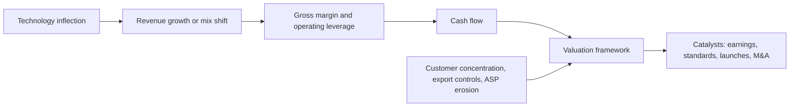
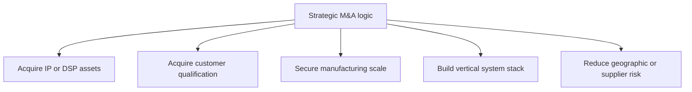

# Investment and M&A Tracker
> **Last Updated:** 2026-06-30
> **Status:** In Review
> **Tags:** investment, valuation, financials, M-and-A, venture-funding, catalysts

## Overview
This tracker links operating indicators to valuation, financing, and strategic transactions. Optical companies differ materially in fiscal calendar, capital intensity, and business mix, so market capitalization and multiples require same-day prices and standardized LTM financials.

The public-company table is a June 9, 2026 snapshot and will become stale. Transaction status is updated through the same date: HPE/Juniper, Nokia/Infinera, AMD/Enosemi, and GlobalFoundries/Advanced Micro Foundry are completed, while the reported Marvell/Celestial AI transaction still requires current filing verification.

> ⚠️ Note: This section is research, not investment advice. High multiples may embed exceptional growth expectations, and optical exposure estimates are not comparable across broad portfolios.

## Key Findings / Highlights
- [CONFIRMED] Coherent's LTM revenue was about $6.60B with 37.0% gross margin and approximately $70.64B EV on June 9, 2026 [Source: S&P Global Market Intelligence via StockAnalysis, 2026-06-09].
- [CONFIRMED] Lumentum's LTM revenue was about $2.49B with 40.8% gross margin and approximately $64.07B EV [Source: same].
- [CONFIRMED] HPE completed its approximately $14B Juniper acquisition on July 2, 2025 after a US DOJ settlement [Source: HPE/DOJ, 2025].
- [CONFIRMED] Nokia completed its approximately $2.3B Infinera acquisition in February 2025 [Source: Nokia, 2025].
- [CONFIRMED] NVIDIA's $2B investments in each of Coherent and Lumentum are strategic investments, not acquisitions [Source: company announcement coverage, 2026-03].

## Visual Guide

## Detailed Content
### Public Company Snapshot
| Company | Ticker | Price ($) | Market Cap ($B) | EV ($B) | LTM Revenue ($B) | EV/Revenue | Gross Margin | Snapshot Quality |
|---|---|---:|---:|---:|---:|---:|---:|---|
| Coherent | COHR | 355.94 | 69.64 | 70.64 | 6.60 | 10.70x | 36.99% | [CONFIRMED] direct page values |
| Lumentum | LITE | 821.76 | 63.93 | 64.07 | 2.49 | 25.75x | 40.84% | [CONFIRMED] direct page values |
| Applied Optoelectronics | AAOI | 162.88 | ~13.1 | ~12.9 | 0.507 | ~25.4x | 29.64% | [ESTIMATED] market cap; financials confirmed |
| Fabrinet | FN | ~586 | ~21.0 | ~20.1 | 4.24 | ~4.7x | 12.04% | [ESTIMATED] market cap; financials confirmed |
| Marvell | MRVL | 266.88 | 233.47 | 229.98 | 8.72 | 26.38x | 51.50% | [CONFIRMED] direct page values |
| Arista Networks | ANET | 152.16 | 191.60 | 179.25 | 9.71 | 18.46x | 63.54% | [CONFIRMED] direct page values |
| Ciena | CIEN | 439.34 | ~62.4 | ~62.6 | 5.57 | ~11.2x | 43.05% | [ESTIMATED] market cap; financials confirmed |
| Cisco | CSCO | ~120.36 | ~474.7 | ~491.1 | 60.75 | ~8.1x | 64.30% | [ESTIMATED] market cap; financials confirmed |
| Nokia | NOK | 13.85 | 77.62 | 74.83 | 23.06 | 3.25x | 45.36% | [CONFIRMED] ADR-based values |
| Viavi | VIAV | 46.03 intraday | 11.28 | 11.82 | 1.37 | 8.65x | 60.36% | [CONFIRMED] direct page values |

### Profitability and Cash Flow
| Company | Operating Margin | LTM Net Income ($M) | LTM FCF ($M) | Interpretation |
|---|---:|---:|---:|---|
| Coherent | 12.08% | 401 | (538) | capacity investment and working-capital effects require review |
| Lumentum | 10.22% | 439 | 114 | valuation embeds substantial growth |
| AAOI | -11.57% | (43) | (449) | capacity-ramp and execution risk |
| Fabrinet | 9.86% | 421 | 46 | high-volume manufacturing, low margin, capital intensive |
| Marvell | 16.41% | 2,530 | 1,670 | high-margin silicon with AI/custom concentration |
| Arista | 42.79% | 3,720 | 5,280 | system/software economics and net cash |
| Ciena | 11.20% | 438 | 833 | transport cycle and cloud/DCI mix |
| Cisco | 23.71% | 11,960 | 11,790 | optical exposure diluted by broad portfolio |
| Nokia | 8.44% | 918 | 1,580 | telecom exposure and Infinera integration |
| Viavi | 8.98% | (55) | 46 | test-cycle exposure and acquisition/debt effects |

### Comparable Classes
| Class | Companies | Interpretation |
|---|---|---|
| Optical components/modules | COHR, LITE, AAOI | closest demand sensitivity; different product mixes |
| Contract manufacturing | FN | volume/capacity proxy; structurally lower gross margin |
| Optical/DSP silicon | MRVL | AI/custom silicon dominates valuation |
| Network systems | ANET, CSCO | optical pull-through, not merchant-optics economics |
| Coherent transport | CIEN, NOK | DCI plus telecom cycle |
| Test | VIAV | enabling capital-equipment/test proxy |

### Transaction Status
| Date | Acquirer / Investor | Target | Value | Current Status | Strategic Rationale |
|---|---|---|---:|---|---|
| 2025-02 | Nokia | Infinera | ~$2.3B EV announced | [CONFIRMED] completed | coherent DSP/PIC and line-system scale |
| 2025-05-28 | AMD | Enosemi | undisclosed | [CONFIRMED] completed | photonic design tools/IP and interconnect expertise |
| 2025-07-02 | HPE | Juniper Networks | ~$14B equity | [CONFIRMED] completed after DOJ settlement | AI/datacenter networking and software |
| 2025-11-17 | GlobalFoundries | Advanced Micro Foundry | undisclosed | [CONFIRMED] acquired | Singapore SiPh foundry scale |
| 2025-12 [TO VERIFY] | Marvell | Celestial AI | ~$3B-class reported | announced/reported; current filing check required | Photonic Fabric scale-up/scale-out IP |
| 2026-03 | NVIDIA | Coherent | $2B investment | [CONFIRMED] strategic investment, not acquisition | laser/optical capacity and access |
| 2026-03 | NVIDIA | Lumentum | $2B investment | [CONFIRMED] strategic investment, not acquisition | laser capacity, new fab, future products |

### Historical Strategic M&A
| Date | Acquirer | Target | Deal Value | Rationale | Status |
|---|---|---:|---:|---|---|
| 2022-07 | II-VI | Coherent | ~$5.7B | vertical optical integration | closed |
| 2021-04 | Cisco | Acacia | ~$4.5B | coherent DSP/modules | closed |
| 2021-04 | Marvell | Inphi | ~$10B | cloud interconnect silicon | closed |
| 2020-04 | NVIDIA | Mellanox | $6.9B | AI/HPC networking | closed |
| 2019 | Cisco | Luxtera | ~$660M | silicon photonics | closed |
| 2016 | Intel | Barefoot Networks | undisclosed | programmable switching | closed |

### HPE / Juniper Remedy Context
| Remedy | Purpose | Relevance |
|---|---|---|
| divest HPE Instant On wireless business | preserve WLAN competition | transaction condition, not optical-specific |
| license Juniper Mist AI source code | preserve competition and innovation | affects network/software integration |
| combined HPE Juniper Networking organization | portfolio integration | update ownership and customer mapping |

### Venture Funding Tracker
| Company | Stage | Amount ($M) | Date | Valuation / Note |
|---|---|---:|---|---|
| Ayar Labs | growth | 155 | 2024-12 | cumulative publicly reported funding roughly $370M |
| Lightmatter | Series D | 400 | 2024-10 | reported valuation $4.4B |
| Celestial AI | Series C | 250 | 2025-03 | acquisition status [TO VERIFY] |
| Nubis Communications | Series B | ~50 [TO VERIFY] | 2024 | exact primary source needed |
| Avicena | Series B | ~65 [TO VERIFY] | 2025 | exact primary source needed |
| Xscape Photonics | Series A | 44 [TO VERIFY] | 2025 | investor list/source refresh needed |

See [11_startups_watchlist.md](11_startups_watchlist.md) for company-level diligence.

### Investor Theses
| Thesis | Bull Case | Bear Case |
|---|---|---|
| Bandwidth density | optics moves closer to compute | electrical reach improves sufficiently |
| Power efficiency | CPO/LPO reduce I/O energy | savings lost to lasers, cooling, yield, repair |
| AI growth | more accelerators and optical links | capex digestion and utilization constraints |
| 1.6T cycle | content and ASP uplift | price erosion and qualification delays |
| Consolidation | scarce IP gains strategic premium | integration and customer conflict |

### Catalyst Calendar
| Timing | Event | Bull Case | Bear Case |
|---|---|---|---|
| March annually | OFC | 1.6T/CPO design wins and interoperability | demonstrations remain pre-volume |
| September/October | ECOC | 200G/lane and packaging progress | yield/reliability delays |
| quarterly | earnings | AI optics exceeds estimates | digestion, margin pressure, concentration |
| IEEE meeting calendar | P802.3dj ballots | stable ecosystem | schedule/objective changes |
| vendor launches | 102.4T and optical-I/O products | broad adoption | thermal/supply constraints |

### Refresh Method
1. Use one market close and diluted share count.
2. Reconcile cash, debt, minority interest, and convertibles from filings.
3. Use GAAP LTM metrics; separate adjusted measures.
4. Preserve dated snapshots in Git history and, when automated, append machine-readable history.
5. Compare valuation only after optical exposure, growth, margin, capital intensity, and concentration.

## Data Tables (where applicable)
| Field | Value | Source | Date |
|---|---|---|---|
| Valuation snapshot | US market close | StockAnalysis/S&P Global MI | 2026-06-09 |
| HPE/Juniper | completed | HPE/DOJ | 2025-07-02 |
| Nokia/Infinera | completed | Nokia | 2025-02 |
| AMD/Enosemi | completed | AMD | 2025-05-28 |
| GF/AMF | acquired | GlobalFoundries | 2025-11-17 |

## Open Questions / Gaps
- Reconcile estimated market caps for AAOI, FN, CIEN, and CSCO to official closing share counts.
- Add YoY growth and optical-specific revenue bridges from filings.
- Verify Marvell/Celestial AI signed terms, regulatory status, and closing date.
- Calculate announcement-date revenue multiples for all deals.
- Add China-listed optical companies with consistent FX/accounting and automate monthly snapshots.

## References
- SEC EDGAR | https://www.sec.gov/edgar/search/ | 2026-06-09
- StockAnalysis company statistics pages | https://stockanalysis.com/stocks/ | 2026-06-09
- HPE Investor Relations | https://investors.hpe.com/ | 2026-06-09
- Nokia Investor Relations | https://www.nokia.com/about-us/investors/ | 2026-06-09
- AMD Newsroom | https://www.amd.com/en/newsroom.html | 2026-06-09
- GlobalFoundries Newsroom | https://gf.com/gf-press-release/ | 2026-06-09
- OFC | https://www.ofcconference.org/ | 2026-06-09
- ECOC | https://www.ecocexhibition.com/ | 2026-06-09
